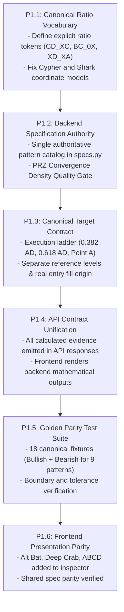

# TradeStrix Harmonic Pattern Intelligence — Architecture & Review Document

> **Version**: 2.0.0 (Governed Post-Review Architecture)  
> **Status**: APPROVED ARCHITECTURAL DIRECTION — GOVERNANCE REVIEW INCORPORATED PRIOR TO IMPLEMENTATION FREEZE  
> **Repository Roots**:  
> - Backend: `c:\Users\91809\dev\TradeStrix\tradestrix-api`  
> - Frontend: `c:\Users\91809\dev\TradeStrix\tradestrix-web`  
> **Target Route**: [`/harmonic-patterns`](https://frontend.fullstackpythondeveloper.in/harmonic-patterns)  
> **Review Branches**:  
> - Backend: `review/harmonic-features-analysis`  
> - Frontend: `review/harmonic-features-analysis`  

---

## Table of Contents
1. [Executive Summary & Architectural Principles](#1-executive-summary--architectural-principles)
2. [Codebase & File Architecture Map](#2-codebase--file-architecture-map)
3. [Global Standard Comparison & Coordinate Verification Matrix](#3-global-standard-comparison--coordinate-verification-matrix)
4. [Harmonic Ratio Coordinate Model & Nomenclature Standards](#4-harmonic-ratio-coordinate-model--nomenclature-standards)
5. [Potential Reversal Zone (PRZ) Convergence & Density Rules](#5-potential-reversal-zone-prz-convergence--density-rules)
6. [Target Architecture: Execution Ladder vs. Pattern-Specific Reference Levels](#6-target-architecture-execution-ladder-vs-pattern-specific-reference-levels)
7. [Strategy Separation: C->D Expansion vs. PRZ Reversal](#7-strategy-separation-cd-expansion-vs-prz-reversal)
8. [Downstream Options Strike Selection Architecture](#8-downstream-options-strike-selection-architecture)
9. [Deep-Dive Architecture & Breakdown for All 6 Core UI Tabs](#9-deep-dive-architecture--breakdown-for-all-6-core-ui-tabs)
   - [Tab 1: Pattern Registry (DB)](#tab-1-pattern-registry-db)
   - [Tab 2: Live Scan](#tab-2-live-scan)
   - [Tab 3: 🔮 Predict D (Forming)](#tab-3--predict-d-forming)
   - [Tab 4: MTF Matrix](#tab-4-mtf-matrix)
   - [Tab 5: 📄 Paper Portfolio](#tab-5--paper-portfolio)
   - [Tab 6: 🔬 Harmonic Lab](#tab-6--harmonic-lab)
10. [Comprehensive Gap Analysis & Technical Findings](#10-comprehensive-gap-analysis--technical-findings)
11. [Governed Phase-1 Remediation & Upgrade Roadmap](#11-governed-phase-1-remediation--upgrade-roadmap)

---

## 1. Executive Summary & Architectural Principles

The **TradeStrix Harmonic Pattern Intelligence** subsystem provides algorithmic detection, predictive projection, multi-timeframe validation, and execution routing for classical and advanced harmonic patterns across Indian equities and major indices (NIFTY 50, BANK NIFTY, FIN NIFTY, MIDCPNIFTY).

### Core Architectural Directives (Post-Review Governance)
1. **Single Mathematical Authority**:  
   The backend (`tradestrix-api`) is the sole authoritative mathematical engine for pattern specifications, Fibonacci ratio validation, PRZ calculation, invalidation stops, target calculations, and confluence scoring. The frontend (`tradestrix-web`) renders backend-computed evidence. Client-side evaluation (e.g. for offline discretionary studio use) must share a versioned canonical spec enforced by golden test parity, eliminating dual-rulebook maintenance.
2. **Explicit Ratio Vocabulary**:  
   Pattern specs must not force heterogeneous geometries into ambiguous fields (e.g. generic `ad_xa`). Every ratio must use explicit coordinate denominators (e.g. `AB_XA`, `BC_AB`, `CD_BC`, `XD_XA`, `CD_XC`, `BC_0X`).
3. **PRZ as a Convergence Quality Zone, Not a Bounding Box**:  
   A valid PRZ requires genuine Fibonacci clustering density. Bounding min/max coordinates without dispersion gating creates excessive risk. Patterns with excessive projection dispersion must be penalized or rejected.
4. **Decoupled Strategy & Execution Engines**:  
   - Harmonic detection operates strictly on underlying price structure.
   - Stage 1 ($C \rightarrow D$ expansion) and Stage 2 (PRZ reversal) are independent trading strategies with opposite directions, distinct invalidation rules, and separate risk ledgers.
   - Downstream derivative strike selection (expiry, moneyness, Greeks, liquidity) is handled by a dedicated options engine rather than hardcoding naive ATM mappings into the pattern core.

---

## 2. Codebase & File Architecture Map

### A. Backend: `tradestrix-api`
| Component | File Path | Primary Responsibility |
| :--- | :--- | :--- |
| **API Router** | `app/modules/harmonics/api/router.py` | REST endpoints for scanning, persistent DB queries, MTF confluence, sandbox evaluation, paper trades, and auto-trade daemon. |
| **Pydantic Schemas** | `app/modules/harmonics/api/schemas.py` | API schemas and request/response validation contracts. |
| **Pattern Specs** | `app/modules/harmonics/domain/specs.py` | Canonical Fibonacci specifications and tolerance models for 9 harmonic patterns. |
| **Geometric Validation** | `app/modules/harmonics/domain/geometry.py` | Multi-point swing leg ratio calculations and geometric adherence scoring. |
| **PRZ Calculator** | `app/modules/harmonics/domain/prz.py` | Multi-Fibonacci cluster calculation, cluster width ATR metrics, and invalidation stops. |
| **Pivot Detection** | `app/modules/harmonics/domain/pivots.py` | Stateful `DualTrackPivotDetector` ensuring strict zero look-ahead bias and ATR swing filtering. |
| **Pattern Engine** | `app/modules/harmonics/application/engine.py` | Incremental candle stream coordinator and pattern state machine lifecycle. |
| **Point D Predictor** | `app/modules/harmonics/application/d_predictor.py` | Mathematical projection of Point D and C->D expansion leg roadmap. |
| **MTF Confluence** | `app/modules/harmonics/application/mtf_confluence.py` | Top-down Macro (1D/4H/1H) -> Micro (15m/5m/3m) confluence, BOS, RSI divergence, and Option Chain OI/PCR. |
| **Universe Scanner** | `app/modules/harmonics/application/scanner.py` | Parallel multi-threaded universe scanner across Indices and F&O Equities. |
| **Auto-Scanner Daemon** | `app/modules/harmonics/application/auto_scanner.py` | Background worker orchestrating multi-tier timeframe scan cycles. |
| **Auto-Trader Daemon** | `app/modules/harmonics/application/auto_trade.py` | Execution daemon managing position limits, risk parameters, and automated order generation. |
| **Paper Trading Desk** | `app/modules/harmonics/application/paper_trading.py` | Mark-to-market simulation ledger and trade lifecycle monitor. |
| **Custom Sandbox** | `app/modules/harmonics/application/sandbox.py` | Discretionary coordinate evaluation and on-demand symbol analyzer. |
| **Pattern DB Repository** | `app/modules/harmonics/repositories/pattern_repository.py` | Thread-safe SQLite persistence layer (`logs/harmonic_patterns.db`). |

### B. Frontend: `tradestrix-web`
| Component | File Path | Primary Responsibility |
| :--- | :--- | :--- |
| **Page Route** | `app/harmonic-patterns/page.tsx` | Next.js App Router entry rendering the Harmonic Shell. |
| **Main Scanner Shell** | `components/harmonic-pattern-scanner-shell.tsx` | Console managing all 6 view modes, filters, lifecycle badges, and modal drawers. |
| **Predictive D Modal** | `components/harmonic-predictive-d-modal.tsx` | Interactive modal visualizing Point D roadmap, C->D expansion, PRZ zone, and risk-reward. |
| **Inspector Drawer** | `components/harmonic-pattern-inspector-drawer.tsx` | Modal inspecting ratio deviations, tolerances, and rule criteria. |
| **Wave & Candle Chart** | `components/harmonic-candle-wave-chart.tsx` | SVG chart rendering dual-stage vectors (C->D expansion & D->Target reversal). |
| **Custom Studio** | `components/harmonic-custom-studio.tsx` | Discretionary coordinate sandbox, custom symbol analyzer, and cheatsheet. |
| **Client Engine Rules** | `lib/harmonic-engine/harmonicRules.ts` | Client pattern evaluation rules and strategy guidebook setups. |
| **Client Pattern Engine** | `lib/harmonic-engine/patternEngine.ts` | Rolling window swing pivot scanner and classical pattern detector. |
| **API Client & Types** | `modules/harmonics/api.ts` & `modules/harmonics/types.ts` | TypeScript contracts and backend HTTP fetchers. |

---

## 3. Global Standard Comparison & Coordinate Verification Matrix

Benchmark against **Scott M. Carney** (*Harmonic Trading Vol. 1 & 2*) and **Larry Pesavento** (*Fibonacci Ratios with Pattern Recognition*):

| Pattern Name | Class | Primary B Retracement | C Pullback Range | D Extension Range | Terminal D Definition | Symmetry Requirement | Literature Definition Alignment | Implementation Semantics Verified |
| :--- | :--- | :--- | :--- | :--- | :--- | :--- | :--- | :--- |
| **Gartley (222)** | Retracement | **0.618** (Exact) | 0.382 - 0.886 | 1.130 - 1.618 | **0.786 of XA** | 1.000 ($AB=CD$) | **Strong Alignment**: Strict 0.618 B; D must not breach X. | **Verified**: Backend tests $AB/XA$, $BC/AB$, $CD/BC$, $XD/XA$. |
| **Bat** | Retracement | 0.382 - **0.500** | 0.382 - 0.886 | 1.618 - 2.618 | **0.886 of XA** | 1.000 - 1.618 | **Strong Alignment**: B must remain $<0.618$; D hits 0.886. | **Verified**: B capped at 0.50, D validated at 0.886. |
| **Alternate Bat** | Extension | **0.382** (Strict) | 0.382 - 0.886 | 2.000 - 3.618 | **1.130 of XA** | 1.000 - 1.618 | **Strong Alignment**: Strict 0.382 B; D extends past X to 1.130. | **Partial**: Backend present; ⚠️ Missing in frontend `harmonicRules.ts`. |
| **Butterfly** | Extension | **0.786** (Deep) | 0.382 - 0.886 | 1.618 - 2.618 | **1.272 - 1.618 of XA** | 1.000 - 1.618 | **Strong Alignment**: Deep 0.786 B; D extends beyond X. | **Verified**: Dual extension validated across backend & frontend. |
| **Crab** | Extension | 0.382 - **0.618** | 0.382 - 0.886 | 2.240 - 3.618 | **1.618 of XA** | 1.000 - 1.618 | **Strong Alignment**: Extreme 1.618 XA extension is mandatory. | **Verified**: Strict 1.618 extension requirement enforced. |
| **Deep Crab** | Extension | **0.886** (Deep) | 0.382 - 0.886 | 2.240 - 3.618 | **1.618 of XA** | 1.000 - 1.618 | **Strong Alignment**: Crab variant with deep 0.886 B-point. | **Partial**: Backend present; ⚠️ Missing in frontend `harmonicRules.ts`. |
| **Cypher** | Non-Carney | 0.382 - **0.618** | **1.272 - 1.414 of XA** | 1.272 - 2.000 | **0.786 of XC** | N/A | **Caution Required**: Point C exceeds A; D is 0.786 of $XC$. | ⚠️ **Discrepancy**: Backend `geometry.py` validates $AD/XA$ generic, while `d_predictor.py` uses $XC$. |
| **Shark** | Emerging (5-0) | 0.500 - 0.886 | **1.130 - 1.618 of AB** | 1.618 - 2.240 | **0.886 - 1.130 of 0X** | N/A | **Caution Required**: 0XABC structure; D is 0.886-1.13 of $0X$. | ⚠️ **Discrepancy**: Backend lacks origin Point 0 tracking in `geometry.py`. |
| **AB=CD** | Reciprocal | 0.382 - 0.886 | 0.382 - 0.886 | 1.130 - 2.618 | N/A (Equal Leg) | **1.000** ($|AB|=|CD|$) | **Strong Alignment**: Strict symmetry in price and time bars. | **Partial**: Backend present; ⚠️ Missing in frontend `harmonicRules.ts`. |

---

## 4. Harmonic Ratio Coordinate Model & Nomenclature Standards

### Canonical Coordinate Vocabulary
To eliminate semantic contradictions across validation and prediction, TradeStrix adopts explicit ratio tokens:

```
Ratio Coordinate Definitions:
────────────────────────────────────────────────────────────────────────
• AB_XA   : |B - A| / |A - X|   (B-point retracement of XA swing)
• BC_AB   : |C - B| / |B - A|   (C-point retracement/extension of AB leg)
• CD_BC   : |D - C| / |C - B|   (D-point projection of BC leg)
• XD_XA   : |D - X| / |A - X|   (Net D-point extension relative to XA)
• AD_XA   : |D - A| / |A - X|   (Net D-point retracement relative to XA)
• CD_XC   : |D - C| / |C - X|   (Special Cypher retracement of XC leg)
• BC_0X   : |C - B| / |X - 0|   (Special Shark extension of 0X leg)
• CD_AB   : |D - C| / |B - A|   (Harmonic symmetry ratio; 1.0 = equal leg)
────────────────────────────────────────────────────────────────────────
```

### Resolution of GAP-00 (Cypher & Shark Specialization)
1. **Cypher Resolution**:
   - `geometry.py` and `HarmonicPatternSpec` must calculate `CD_XC = abs(D - C) / abs(C - X)` rather than forcing a generic `AD / XA`.
   - Reversal targets for Cypher must reference Point A and the $XC$ leg.
2. **Shark Resolution**:
   - Track optional Anchor Point 0 ($O$) in `PivotPoint` sequences.
   - When Anchor 0 is present, validate $BC / 0X$ and $CD / 0X$; when Anchor 0 is absent, evaluate standard Shark $CD / BC$ and $XD / XA$ approximations with a downgraded confidence tag.

---

## 5. Potential Reversal Zone (PRZ) Convergence & Density Rules

### Beyond Bounding Boxes: Convergence-Quality Gating
Currently, `PRZCalculator` assigns $\text{PRZ Low} = \min(P_1, P_2, P_3)$ and $\text{PRZ High} = \max(P_1, P_2, P_3)$. This creates an outer bounding box that can mask poor Fibonacci convergence.

```
       Scattered Outlier (Low Quality)            Tight Harmonic Convergence (High Quality)
       ----------------------------- P1           ============================= P1
                                                  ============================= P2 [Tight PRZ Zone]
       ----------------------------- P2           ============================= P3
                                                  
       ----------------------------- P3           ----------------------------- Terminal Stop
       [Excessive Spread: Reject/Downgrade]       [Density Score >= 0.75: Execute]
```

### The PRZ Convergence Quality Metric
TradeStrix incorporates a formal **Convergence Quality Metric** before qualifying any PRZ:
$$\text{Normalized Dispersion} = \frac{\max(P_i) - \min(P_i)}{\max(\text{ATR}_{14}, 0.01)}$$
$$\text{Convergence Density Score} = \text{clip}\left(1.0 - \frac{\text{Normalized Dispersion}}{\text{Max Dispersion Threshold}}, 0.0, 1.0\right)$$

- **Threshold Rules**:
  - If $\text{Normalized Dispersion} > 1.5 \times \text{ATR}$: Classify as `WEAK_DISPERSION`. Downgrade pattern quality score by 35% and block auto-entry.
  - If an outlier projection accounts for $>60\%$ of total cluster spread: Flag `OUTLIER_DILUTION` and require lower-timeframe BOS confirmation before trade enablement.
  - High-Conviction Gate: $\ge 2$ independent harmonic projections must converge within $\le 0.40 \times \text{ATR}$.

---

## 6. Target Architecture: Execution Ladder vs. Pattern-Specific Reference Levels

To prevent inconsistencies between backend execution and frontend display, targets are bifurcated into **two independent layers**:

```
                              Harmonic Target Structure
                                          │
                 ┌────────────────────────┴────────────────────────┐
                 ▼                                                 ▼
     Canonical Execution Ladder                       Pattern-Specific Reference Objectives
     (Formal Automated Order Fills)                   (Confluence / Discretionary Review)
     ─────────────────────────────────                ─────────────────────────────────────
     • Target 1: Entry + 0.382 * AD                   • Point B Structural Level
     • Target 2: Entry + 0.618 * AD                   • Point C Structural Level
     • Target 3: Point A Structure Retest             • CD Retracement Levels (e.g. 0.50 CD)
                                                      • S/R Cluster Confluences
```

### Separation of Geometry from Execution Policy
- **Pure Pattern Geometry**:
  - $T_1 = D_{\text{confirmed}} \pm (0.382 \times |A - D|)$
  - $T_2 = D_{\text{confirmed}} \pm (0.618 \times |A - D|)$
  - $T_3 = \text{Point A price}$
- **Real-Origin Adjustment**:
  - When pattern is `PROJECTED`: Use `prz_mid` to project theoretical targets.
  - When pattern is `CONFIRMED`: Use `confirmed_d_price`.
  - When order is `FILLED`: Store `actual_entry_price` to calculate realized R:R.
- **Execution & Position Sizing Policy (Decoupled)**:
  - Partial exit percentages (e.g. 50% at T1, 30% at T2, 20% at T3) and trailing stop logic belong in `HarmonicAutoTradeSettings` and can be adjusted per account without modifying the underlying geometry engine.

---

## 7. Strategy Separation: C->D Expansion vs. PRZ Reversal

Stage 1 (C->D expansion scalp) and Stage 2 (PRZ reversal) have opposing market direction, different invalidations, and different risk characteristics. TradeStrix models them as **two independent strategies**:

| Strategy Parameter | `HARMONIC_CD_EXPANSION` | `HARMONIC_PRZ_REVERSAL` |
| :--- | :--- | :--- |
| **Trade Type** | Trend-following scalp toward PRZ | Counter-trend / Mean-reversion out of PRZ |
| **Direction** | Same direction as $C \rightarrow D$ swing | Opposite direction (buying Bullish D, selling Bearish D) |
| **Entry Trigger** | Confirmed Point C pivot + Break of minor swing | Touch of PRZ + Micro BOS / Candlestick confirmation |
| **Primary Target** | Projected `prz_mid` (Point D completion) | Target 1 ($0.382\times AD$) & Target 2 ($0.618\times AD$) |
| **Invalidation Stop** | Breach of Point C extreme | Terminal Stop beyond PRZ / Point X |
| **Risk Allocation** | Reduced risk (0.5% capital) due to counter-reversal risk | Standard risk (1.0% - 1.5% capital) |
| **Audit Ledger** | Tagged as `STRATEGY_CD_EXPANSION` | Tagged as `STRATEGY_PRZ_REVERSAL` |

---

## 8. Downstream Options Strike Selection Architecture

Harmonic patterns are identified strictly on underlying spot/futures price action. Order execution on Indian indices (NIFTY, BANKNIFTY) routes through a dedicated **Option Selection Pipeline**:

```
[Harmonic Reversal Confirmed on Underlying]
                   │
                   ▼ Emits Signal:
      { symbol: "NIFTY", direction: "BULLISH_REVERSAL", prz_stop: 24150, target_1: 24380 }
                   │
                   ▼
┌────────────────────────────────────────────────────────────────────────┐
│                   Option Contract Selection Engine                     │
├────────────────────────────────────────────────────────────────────────┤
│ 1. Expiry Selection: Weekly nearest (skip if DTE == 0 and time > 14:00)│
│ 2. Side Selection: BULLISH -> CE contract | BEARISH -> PE contract     │
│ 3. Strike Selection: ATM or +1 ITM based on Delta (Target Delta: 0.50) │
│ 4. Liquidity & Spread Gate: Bid-Ask Spread <= 1.2%, Minimum OI >= 500k │
│ 5. Lot Sizing: Calculated from risk amount / option stop distance      │
└────────────────────────────────────────────────────────────────────────┘
                   │
                   ▼
       [Order Placed to Broker via Adapter: Kotak / Upstox / Kite]
```

---

## 9. Deep-Dive Architecture & Breakdown for All 6 Core UI Tabs

```html
<div class="btn-group p-1 bg-surface rounded-3 border shadow-sm" role="group">
  <button type="button" class="btn btn-sm btn-primary shadow-sm fw-semibold"><i class="bi bi-database me-1"></i> Pattern Registry (DB)</button>
  <button type="button" class="btn btn-sm btn-light text-secondary"><i class="bi bi-broadcast me-1"></i> Live Scan</button>
  <button type="button" class="btn btn-sm btn-light text-secondary"><i class="bi bi-bullseye me-1"></i> 🔮 Predict D (Forming)</button>
  <button type="button" class="btn btn-sm btn-light text-secondary"><i class="bi bi-layers-half me-1"></i> MTF Matrix</button>
  <button type="button" class="btn btn-sm btn-light text-secondary"><i class="bi bi-journal-check me-1"></i> 📄 Paper Portfolio</button>
  <button type="button" class="btn btn-sm btn-light text-secondary"><i class="bi bi-sliders me-1"></i> 🔬 Harmonic Lab</button>
</div>
```

---

### Tab 1: Pattern Registry (DB)
- **UI Button**: `<i class="bi bi-database me-1"></i> Pattern Registry (DB)`
- **View Mode**: `viewMode === "database"`
- **Backend Endpoint**: `GET /api/v1/pattern-intelligence/db-patterns`
- **Database**: `logs/harmonic_patterns.db` (Table: `harmonic_patterns`)
- **Operational Logic**:
  - Pulls historical and active patterns cached by the background daemon.
  - Runs real-time lifecycle categorization via `getPatternLifecycle()` (`FORMING_D`, `TARGET_ACHIEVED`, `SL_BREACHED`, `OPEN_ACTIVE / IN PRZ`).
  - Presents summary metrics: Active setups, high-conviction counts, bullish/bearish ratio.

### Tab 2: Live Scan
- **UI Button**: `<i class="bi bi-broadcast me-1"></i> Live Scan`
- **View Mode**: `viewMode === "live"`
- **Backend Endpoint**: `POST /api/v1/pattern-intelligence/scan`
- **Service**: `app/modules/harmonics/application/scanner.py::scan_harmonic_universe`
- **Operational Logic**:
  - Concurrently queries broker candle history across indices and F&O universe.
  - Feeds bars into `DualTrackPivotDetector` and `PatternIntelligenceEngine`.
  - Calculates geometry scores, PRZ bounds, reward-to-risk, and S/R proximity levels.

### Tab 3: 🔮 Predict D (Forming)
- **UI Button**: `<i class="bi bi-bullseye me-1"></i> 🔮 Predict D (Forming)`
- **View Mode**: `viewMode === "emerging_d"`
- **Backend Endpoints**: `GET /api/v1/pattern-intelligence/emerging-patterns` & `predict-d/{instrument_key}`
- **Engine**: `HarmonicDPredictor` in `d_predictor.py`
- **Operational Logic**:
  - Scans for 4-point swings ($X-A-B-C$) where Point D is forming.
  - Computes mathematical Point D PRZ target box before pattern completes.
  - Opens `HarmonicPredictiveDModal` displaying SVG projection chart and dual-stage trade roadmap.

### Tab 4: MTF Matrix
- **UI Button**: `<i class="bi bi-layers-half me-1"></i> MTF Matrix`
- **View Mode**: `viewMode === "mtf_confluence"`
- **Backend Endpoint**: `GET /api/v1/pattern-intelligence/mtf-universe-confluence`
- **Service**: `mtf_confluence_service` in `mtf_confluence.py`
- **Operational Logic**:
  - Evaluates Macro (1D/4H/1H) patterns against Micro (15m/5m/3m) structure.
  - Classifies into 4 readiness stages: `MICRO_TRIGGER_CONFIRMED`, `IN_PRZ_MONITORING`, `MACRO_DETECTED`, `INVALIDATED`.
  - Gated by Micro Break of Structure (BOS), candlestick reversals, Wilder's RSI divergence, and live Option Chain Open Interest / PCR.

### Tab 5: 📄 Paper Portfolio
- **UI Button**: `<i class="bi bi-journal-check me-1"></i> 📄 Paper Portfolio`
- **View Mode**: `viewMode === "paper_portfolio"`
- **Backend Endpoints**: `GET/POST /api/v1/pattern-intelligence/paper-trades` & `auto-trade/settings`
- **Services**: `HarmonicPaperTradeService` & `HarmonicAutoTradeService`
- **Databases**: `logs/harmonic_paper_trades.db` & `logs/harmonic_auto_trade_settings.db`
- **Operational Logic**:
  - Real-time simulation ledger tracking entry, current price, unrealized/realized P&L, hold duration, win rate.
  - Automated exit monitor auto-closing positions on Target or Stop touch; moves SL to Breakeven at Target 1.
  - Auto-trade daemon settings controller (Paper vs Live mode, risk limits, 15:15 auto square-off).

### Tab 6: 🔬 Harmonic Lab
- **UI Button**: `<i class="bi bi-sliders me-1"></i> 🔬 Harmonic Lab`
- **View Mode**: `viewMode === "custom_studio"`
- **Backend Endpoints**: `POST /api/v1/pattern-intelligence/sandbox/evaluate` & `GET /custom-analyze`
- **Component**: `HarmonicCustomStudio` in `components/harmonic-custom-studio.tsx`
- **Operational Logic**:
  - Discretionary coordinate evaluation sandbox ($X, A, B, C, D$) and on-demand NSE ticker analyzer.
  - Displays calculated ratio deviations against all 9 harmonic specifications.
  - Renders interactive dual-stage SVG wave chart and embedded cheatsheet reference guide.

---

## 10. Comprehensive Gap Analysis & Technical Findings

| Gap ID | Category | Specific Finding & Root Cause | Impact | Action Required |
| :---: | :--- | :--- | :--- | :--- |
| **GAP-00** | **Ratio Coordinate Inconsistency** | `geometry.py` validates generic `ad_xa` as $\|A-D\|/\|X-A\|$, while `d_predictor.py` and Cypher specs define D as 0.786 of $XC$. Shark requires Point 0 tracking ($0X$ leg). | Completed validation and prediction speak different geometric languages for Cypher and Shark. | Introduce explicit ratio tokens (`CD_XC`, `BC_0X`, `XD_XA`) across all validation layers. |
| **GAP-01** | **Pattern & Execution Semantics Parity** | `harmonicRules.ts` defines 6 patterns; `specs.py` defines 9 (missing Alt Bat, Deep Crab, ABCD). Shared patterns also differ in target rules, tolerance allowances, and stops. | Frontend inspector cannot evaluate all backend patterns and displays divergent targets. | Promote backend as single mathematical authority; frontend renders backend evidence or shares canonical JSON spec. |
| **GAP-02** | **PRZ Convergence Gating** | `PRZCalculator` assigns $\min$ and $\max$ of projections as PRZ boundaries without checking cluster dispersion. | Outlier projections artificially inflate PRZ width; trades taken in loose, non-convergent zones. | Add `Convergence Density Score` gate; penalize or reject patterns where dispersion $>1.5\times\text{ATR}$. |
| **GAP-03** | **Index Options Strike Pipeline** | Auto-trader generates index spot units (`index_quantity`) instead of routing to weekly Call/Put options contracts. | Live execution on NIFTY/BANKNIFTY will fail or trade spot rather than options. | Connect downstream Option Selection Pipeline (ATM/OTM CE/PE based on delta, liquidity, spread). |
| **GAP-04** | **1-Minute Timeframe Readiness** | `1m` is present in router docstrings but absent from `SUPPORTED_TIMEFRAMES` in `scanner.py`. | Calling 1m scans falls back to 3m default or causes timeframe resolution errors. | Add 1m after verifying broker capability, session normalization, rate budgets, and ATR calibration. |
| **GAP-05** | **Real-Time Tick PRZ Execution** | Active paper trades and auto-trades update via 15s polling loop. | Rapid intra-candle PRZ bounces can touch target/stop and exit before polling cycle detects it. | Integrate Redis live tick stream for sub-second PRZ touch and exit execution. |
| **GAP-06** | **Custom Studio Pivot Prefill** | Discretionary studio requires typing 5 coordinates manually. | Tedious user experience for discretionary wave analysis. | Add "Auto-Fill Latest Pivots" button fetching confirmed swing extremes from the chart. |

---

## 11. Governed Phase-1 Remediation & Upgrade Roadmap



### Action Checklist
- [ ] **P1.1 — Canonical Ratio Vocabulary**: Update `geometry.py` and `HarmonicPatternSpec` with explicit tokens (`AB_XA`, `BC_AB`, `CD_BC`, `XD_XA`, `AD_XA`, `CD_XC`, `BC_0X`, `CD_AB`).
- [ ] **P1.2 — Backend Specification Authority & PRZ Gate**: Enforce backend as single authority; implement `Convergence Density Score` in `PRZCalculator`.
- [ ] **P1.3 — Canonical Target Contract**: Standardize AD execution targets ($T_1, T_2, T_3$) while exposing pattern-specific structural levels as reference confluence.
- [ ] **P1.4 — API Contract**: Ensure `HarmonicScanResult` and `HarmonicDBQueryResponse` return full evidence so frontend never recalculates execution math.
- [ ] **P1.5 — Golden Parity Test Suite**: Write comprehensive tests with at least 18 bullish/bearish fixtures verifying ratios $\rightarrow$ classification $\rightarrow$ PRZ $\rightarrow$ invalidation $\rightarrow$ targets.
- [ ] **P1.6 — Frontend Presentation Parity**: Update `harmonicRules.ts` and `HarmonicPatternInspectorDrawer` to render all 9 patterns seamlessly using the canonical backend contract.
