# TradeStrix Harmonic Pattern Intelligence — Architecture & Review Document

> **Version**: 2.2.3 (Final Forensic Reconciliation — Frozen Architecture Specification)  
> **Status**: ARCHITECTURAL REVIEW COMPLETE — P1.1 CONTRACT FROZEN, IMPLEMENTATION NOT YET AUTHORIZED  
> **Supersedes**: v2.2.2 (corrected Shark completion ratio from OC_OX to XC_OX, separated Ultimate/Pine AB_XA from Carney XB_XA, mapped Carney impulse to AC_XA, added CD_AB pre-merge impact gate, and frozen Option A scoring; see [Appendix A](#appendix-a--v223-corrective-changelog))  
> **Primary Literature Sources Reconciled**: Carney, *Harmonic Trading Vol. 3: Reaction vs. Reversal* (Shark pp. 116–125, 5-0 pp. 129+); *The Ultimate Harmonic Pattern Trading Guides* (Cypher ch. 2, Shark ch. 6)  
> **Repository Roots**:  
> - Backend: `c:\Users\91809\dev\TradeStrix\tradestrix-api`  
> - Frontend: `c:\Users\91809\dev\TradeStrix\tradestrix-web`  
> **Target Route**: [`/harmonic-patterns`](https://frontend.fullstackpythondeveloper.in/harmonic-patterns)  
> **Review Branches**:  
> - Backend: `review/harmonic-features-analysis`  
> - Frontend: `review/harmonic-features-analysis`  

---

## Table of Contents
1. [Executive Summary & Core Architectural Directives](#1-executive-summary--core-architectural-directives)
2. [Codebase & File Architecture Map](#2-codebase--file-architecture-map)
3. [Global Standard Comparison & Coordinate Verification Matrix](#3-global-standard-comparison--coordinate-verification-matrix)
4. [Harmonic Ratio Coordinate Model & Topology Standards](#4-harmonic-ratio-coordinate-model--topology-standards)
   - [A. Terminal Ratios: `AD_XA` vs `XD_XA`](#a-clarification-on-terminal-ratios-ad_xa-vs-xd_xa)
   - [B. Canonical Ratio Token Vocabulary (FROZEN)](#b-canonical-coordinate-definitions--ratio-token-invariant)
   - [C. Pattern Topology Contracts](#c-pattern-topology-contracts-patterntopology)
   - [D. Per-Pattern Authoritative Contracts](#d-per-pattern-authoritative-contracts-frozen--harmonics-222)
   - [E. Required vs Optional Ratio Semantics](#e-required-vs-optional-ratio-semantics)
   - [F. Prohibition on Synthetic Coordinates](#f-prohibition-on-synthetic-coordinates)
   - [G. Domain vs Runtime Activation Boundary](#g-domain-vs-runtime-activation-boundary)
5. [Potential Reversal Zone (PRZ) Convergence & Density Rules](#5-potential-reversal-zone-prz-convergence--density-rules)
6. [Target Architecture: Execution Ladder vs. Pattern-Specific Structural Levels](#6-target-architecture-execution-ladder-vs-pattern-specific-structural-levels)
7. [Strategy Separation: C->D Expansion vs. PRZ Reversal](#7-strategy-separation-cd-expansion-vs-prz-reversal)
8. [Downstream Options Strike Selection Architecture](#8-downstream-options-strike-selection-architecture)
9. [Deep-Dive Architecture & Breakdown for All 6 Core UI Tabs](#9-deep-dive-architecture--breakdown-for-all-6-core-ui-tabs)
   - [Tab 1: Pattern Registry (DB)](#tab-1-pattern-registry-db)
   - [Tab 2: Live Scan](#tab-2-live-scan)
   - [Tab 3: 🔮 Predict D (Forming)](#tab-3--predict-d-forming)
   - [Tab 4: MTF Matrix](#tab-4-mtf-matrix)
   - [Tab 5: 📄 Paper Portfolio](#tab-5--paper-portfolio)
   - [Tab 6: 🔬 Harmonic Lab](#tab-6--harmonic-lab)
10. [Comprehensive Gap Analysis & Technical Findings](#10-comprehensive-gap-analysis--technical-findings)
11. [Governed Phase-1 Remediation & Upgrade Roadmap](#11-governed-phase-1-remediation--upgrade-roadmap)
12. [Appendix A — v2.2.2 Corrective Changelog](#appendix-a--v222-corrective-changelog)

---

## 1. Executive Summary & Core Architectural Directives

The **TradeStrix Harmonic Pattern Intelligence** subsystem provides algorithmic detection, predictive projection, multi-timeframe validation, and execution routing for classical and advanced harmonic patterns across Indian equities and major indices (NIFTY 50, BANK NIFTY, FIN NIFTY, MIDCPNIFTY).

### Core Architectural Directives (Final Governed Specification)

0. **Harmonic Source Interpretation Precedence**:  
   When translating external harmonic literature into TradeStrix, engineering must strictly observe this priority sequence:  
   1. Primary-source plotted endpoints and diagram geometry  
   2. Explicit numeric anchors and worked numerical examples  
   3. Explicit numerator and denominator formulas  
   4. Prose descriptions  
   5. Secondary-source shorthand labels  
   > **Invariant**: A `RatioToken` MUST NOT be frozen from prose labels alone. Always reconstruct the physical start point, end point, reference leg, numerator, and denominator before assigning a TradeStrix token. If prose and diagram appear contradictory, the discrepancy must be mathematically documented and reconciled before freezing the specification.

1. **Single Mathematical Authority** *(TARGET — not yet achieved)*:  
   **Target state**: the modular backend subsystem `app/modules/harmonics/` is the sole authoritative mathematical engine for pattern specifications, Fibonacci ratio validation, PRZ calculation, invalidation stops, target calculations, and confluence scoring. The frontend (`tradestrix-web`) renders backend-computed evidence. Client-side evaluation (e.g. for offline discretionary studio use) must share a versioned canonical spec enforced by golden test parity, eliminating duplicate rulebooks.

   > ⚠️ **CURRENT STATE (verified 2026-10-03)**: this directive describes the target, **not** the present. A second, fully independent harmonic engine — `app/core/harmonics.py` (461 lines, its own `_PatternDefinition` ratio table, its own `detect_zigzag_swings` pivot detector, 5 patterns only: Gartley / Bat / Butterfly / Crab / AB=CD) — is **live** and consumed by the trading-strategy path `app/core/strategies.py`. See [GAP-08](#10-comprehensive-gap-analysis--technical-findings). Until that convergence is scheduled and completed, no document, test, or code comment may assert that single mathematical authority already exists.

2. **Explicit Ratio Vocabulary & Strict Topology Contracts**:  
   Pattern specs must not force heterogeneous geometries into ambiguous fields. Standard XABCD patterns, 4-point AB=CD reciprocal structures, and 5-swing Shark structures each use their native coordinate topologies with mandatory non-null coordinate requirements:
   - `PatternTopology = "XABCD"` $\rightarrow$ strictly requires `{X, A, B, C, D}`
   - `PatternTopology = "OXABC"` $\rightarrow$ strictly requires `{O, X, A, B, C}`
   - `PatternTopology = "ABCD"`  $\rightarrow$ strictly requires `{A, B, C, D}`  
   Every ratio must use explicit coordinate denominators. The frozen vocabulary is exactly **twelve tokens** — see [§4.B](#b-canonical-coordinate-definitions--ratio-token-invariant).

   > **System-Wide Ratio Token Invariant**:  
   > A ratio token **MUST** have exactly one mathematical definition system-wide. Pattern-specific semantics **MUST** be represented using a distinct ratio token rather than changing the meaning of an existing token. Under no circumstances may an existing token (such as `AD_XA`) be repurposed, overloaded, or redefined for specific patterns (e.g. Cypher's $CD/XC$ or Shark's $OC/OX$). New geometric relationships require dedicated, immutable tokens.
   >
   > **Corollary — tokens are anchored to physical segments, never to shorthand labels.** Harmonic literature uses inconsistent shorthand: the Cypher rule written "BC = 1.272–1.414 of the XA leg" physically constrains Point C relative to XA (token `XC_XA`), and Carney's Shark completion measure written "0B" physically measures the origin retest at Point C relative to 0X (token `XC_OX`). A token name must describe the exact numerator and denominator segments it evaluates, never descriptive source shorthand.

3. **Separation of Literature Constants from Empirical Policy Parameters**:  
   Literature-defined Fibonacci relationships ($0.382, 0.500, 0.618, 0.786, 0.886, 1.130, 1.272, 1.414, 1.618, 2.000, 2.240, 2.618, 3.618$) belong to canonical pattern specifications. Liquidity thresholds, scoring thresholds, confirmation gates, risk percentages, and execution parameters are configurable strategy policy and require empirical backtest calibration.

4. **Versioned Reproducibility & Dual Data-Spec Provenance**:  
   Every detected, projected, paper-traded, live-executed, or backtested harmonic setup must persist:
   - The canonical specification version: `pattern_spec_version: "harmonics-2.2.3"`
   - The engine policy versions: `geometry_engine_version`, `target_policy_version`, `confluence_policy_version`
   - The market data version: `data_snapshot_version` (or dataset hash / candle interval checksum)  
   Historical records must never be silently reinterpreted when rules or datasets evolve.

5. **PRZ as a Convergence Quality Zone, Not a Bounding Box**:  
   A valid PRZ requires genuine Fibonacci clustering density. Bounding min/max coordinates without dispersion gating creates excessive risk. Patterns with excessive projection dispersion must be penalized or rejected.

6. **Replay vs. Live Determinism Scope**:  
   Determinism equality applies strictly to **finalized-bar decisions**. While intrabar tentative pivots may legitimately fluctuate until bar close, feeding identical finalized historical candle sequences through offline replay versus incremental live streaming must produce 100% identical confirmed pivots, pattern classifications, PRZ bounds, targets, and lifecycle transitions.

7. **Decoupled Strategy & Execution Engines**:  
   - Harmonic detection operates strictly on underlying price structure.
   - Stage 1 ($C \rightarrow D$ expansion) and Stage 2 (PRZ reversal) are independent trading strategies with opposite directions, distinct invalidation rules, and separate risk ledgers (`HARMONIC_CD_EXPANSION` vs `HARMONIC_PRZ_REVERSAL`).
   - Downstream derivative strike selection (expiry, moneyness, Greeks, liquidity) is handled by a dedicated options engine rather than hardcoding naive ATM mappings into the pattern core.

---

## 2. Codebase & File Architecture Map

### A. Backend: `tradestrix-api`
| Component | File Path | Primary Responsibility |
| :--- | :--- | :--- |
| **API Router** | `app/modules/harmonics/api/router.py` | REST endpoints for scanning, persistent DB queries, MTF confluence, sandbox evaluation, paper trades, and auto-trade daemon. |
| **Pydantic Schemas** | `app/modules/harmonics/api/schemas.py` | API schemas and request/response validation contracts. |
| **Pattern Specs** | `app/modules/harmonics/domain/specs.py` | Canonical Fibonacci specifications and tolerance models for 9 harmonic patterns. |
| **Geometric Validation** | `app/modules/harmonics/domain/geometry.py` | Multi-point swing leg ratio calculations and geometric adherence scoring. |
| **PRZ Calculator** | `app/modules/harmonics/domain/prz.py` | Multi-Fibonacci cluster calculation, cluster width ATR metrics, and invalidation stops. |
| **Pivot Detection** | `app/modules/harmonics/domain/pivots.py` | Stateful `DualTrackPivotDetector` ensuring strict zero look-ahead bias and ATR swing filtering. |
| **Pattern Engine** | `app/modules/harmonics/application/engine.py` | Incremental candle stream coordinator and pattern state machine lifecycle. |
| **Point D Predictor** | `app/modules/harmonics/application/d_predictor.py` | Mathematical projection of Point D and C->D expansion leg roadmap. |
| **MTF Confluence** | `app/modules/harmonics/application/mtf_confluence.py` | Top-down Macro (1D/4H/1H) -> Micro (15m/5m/3m) confluence, BOS, RSI divergence, and Option Chain OI/PCR. |
| **Universe Scanner** | `app/modules/harmonics/application/scanner.py` | Parallel multi-threaded universe scanner across Indices and F&O Equities. |
| **Auto-Scanner Daemon** | `app/modules/harmonics/application/auto_scanner.py` | Background worker orchestrating multi-tier timeframe scan cycles. |
| **Auto-Trader Daemon** | `app/modules/harmonics/application/auto_trade.py` | Execution daemon managing position limits, risk parameters, and automated order generation. |
| **Paper Trading Desk** | `app/modules/harmonics/application/paper_trading.py` | Mark-to-market simulation ledger and trade lifecycle monitor. |
| **Custom Sandbox** | `app/modules/harmonics/application/sandbox.py` | Discretionary coordinate evaluation and on-demand symbol analyzer. |
| **Pattern DB Repository** | `app/modules/harmonics/repositories/pattern_repository.py` | Thread-safe SQLite persistence layer (`logs/harmonic_patterns.db`). |
| **Legacy Compatibility Façades** | `app/services/pattern_intelligence/*.py` (17 files) | Pure re-export shims pointing at `app.modules.harmonics.*`. Still imported by `tests/test_pattern_intelligence_*.py`; renaming any re-exported symbol breaks these at **import time**. |

### A2. Backend — Legacy / Parallel Live Harmonic Authority ⚠️

> **Classification**: `LEGACY / PARALLEL LIVE AUTHORITY — PENDING MIGRATION`  
> **Status**: live in production, **out of scope for P1.1 and P1.1b**, no owner or target phase assigned.

| Component | File Path | Reality |
| :--- | :--- | :--- |
| **Legacy Harmonic Engine** | `app/core/harmonics.py` | Fully independent 461-line engine. Own `_PatternDefinition` dataclass with its own `ab_xa` / `bc_ab` / `cd_bc` / `ad_xa` / `cd_ab` tuple ranges, and its own `detect_zigzag_swings` pivot detector. Defines **5 patterns only** (Gartley, Bat, Butterfly, Crab, AB=CD) — **no Shark, no Cypher, no Alternate Bat, no Deep Crab**. Shares **zero** imports with `app/modules/harmonics/`. |
| **Legacy Consumer** | `app/core/strategies.py` | Imports `find_best_harmonic_pattern` and `HarmonicPatternMatch` (lines 6, 207, 265, 272, 285, 404). This is a **trading-strategy execution path**, not a dashboard. |

**Why this matters for P1.1**: the canonical ratio vocabulary frozen in [§4.B](#b-canonical-coordinate-definitions--ratio-token-invariant) governs `app/modules/harmonics/` **only**. `app/core/harmonics.py` retains its own divergent rulebook. Any statement that the ratio vocabulary is enforced "system-wide" is scoped to the modular subsystem.

**Note on prior art**: this legacy file's `abcd` definition (`ab_xa=None`, constraining only `bc_ab` and `cd_ab`) is **more topologically correct** than the current modular `specs.py["abcd"]`, which fabricates `ab_xa` and `ad_xa` for a pattern that has no Point X. See [§7 AB=CD contract](#c-pattern-topology-contracts-patterntopology).

### B. Frontend: `tradestrix-web`
| Component | File Path | Primary Responsibility |
| :--- | :--- | :--- |
| **Page Route** | `app/harmonic-patterns/page.tsx` | Next.js App Router entry rendering the Harmonic Shell. |
| **Main Scanner Shell** | `components/harmonic-pattern-scanner-shell.tsx` | Console managing all 6 view modes, filters, lifecycle badges, and modal drawers. |
| **Predictive D Modal** | `components/harmonic-predictive-d-modal.tsx` | Interactive modal visualizing Point D roadmap, C->D expansion, PRZ zone, and risk-reward. |
| **Inspector Drawer** | `components/harmonic-pattern-inspector-drawer.tsx` | Modal inspecting ratio deviations, tolerances, and rule criteria. |
| **Wave & Candle Chart** | `components/harmonic-candle-wave-chart.tsx` | SVG chart rendering dual-stage vectors (C->D expansion & D->Target reversal). |
| **Custom Studio** | `components/harmonic-custom-studio.tsx` | Discretionary coordinate sandbox, custom symbol analyzer, and cheatsheet. |
| **Client Engine Rules** | `lib/harmonic-engine/harmonicRules.ts` | Client pattern evaluation rules and strategy guidebook setups. |
| **Client Pattern Engine** | `lib/harmonic-engine/patternEngine.ts` | Rolling window swing pivot scanner and classical pattern detector. |
| **API Client & Types** | `modules/harmonics/api.ts` & `modules/harmonics/types.ts` | TypeScript contracts and backend HTTP fetchers. |

---

## 3. Global Standard Comparison & Coordinate Verification Matrix

Benchmark against **Scott M. Carney** (*Harmonic Trading Vol. 1 & 2*) and **Larry Pesavento** (*Fibonacci Ratios with Pattern Recognition*):

| Pattern Name | Topology | Primary B Retracement | C Pullback Range | D Extension Range | Terminal D Definition | Symmetry Requirement | Literature Definition Alignment | Implementation Semantics Verified |
| :--- | :--- | :--- | :--- | :--- | :--- | :--- | :--- | :--- |
| **Gartley (222)** | `XABCD` | **0.618** (Exact) | 0.382 - 0.886 | 1.130 - 1.618 | **0.786 of XA** | 1.000 ($AB=CD$) | **Strong Alignment**: Strict 0.618 B; D must not breach X. | **Verified for standard XABCD geometry**: Backend currently tests $AB/XA$, $BC/AB$, $CD/BC$, and $AD/XA$. |
| **Bat** | `XABCD` | 0.382 - **0.500** | 0.382 - 0.886 | 1.618 - 2.618 | **0.886 of XA** | 1.000 - 1.618 | **Strong Alignment**: B must remain $<0.618$; D hits 0.886. | **Verified**: B capped at 0.50, D validated at 0.886 of $XA$. |
| **Alternate Bat** | `XABCD` | **0.382** (Strict) | 0.382 - 0.886 | 2.000 - 3.618 | **1.130 of XA** | 1.000 - 1.618 | **Strong Alignment**: Strict 0.382 B; D extends past X to 1.130. | **Partial**: Backend present; ⚠️ Missing in frontend `harmonicRules.ts`. |
| **Butterfly** | `XABCD` | **0.786** (Deep) | 0.382 - 0.886 | 1.618 - 2.618 | **1.272 - 1.618 of XA** | 1.000 - 1.618 | **Strong Alignment**: Deep 0.786 B; D extends beyond X. | **Verified**: Dual extension validated across backend & frontend. |
| **Crab** | `XABCD` | 0.382 - **0.618** | 0.382 - 0.886 | 2.240 - 3.618 | **1.618 of XA** | 1.000 - 1.618 | **Strong Alignment**: Extreme 1.618 XA extension is mandatory. | **Verified**: Strict 1.618 extension requirement enforced. |
| **Deep Crab** | `XABCD` | **0.886** (Deep) | 0.382 - 0.886 | 2.240 - 3.618 | **1.618 of XA** | 1.000 - 1.618 | **Strong Alignment**: Crab variant with deep 0.886 B-point. | **Partial**: Backend present; ⚠️ Missing in frontend `harmonicRules.ts`. |
| **Cypher** | `XABCD` | `AB_XA` 0.382 - **0.618** | **`XC_XA` 1.272 - 1.414** (C extends *beyond* A) | n/a — D defined off $XC$ | **`CD_XC` = 0.786** | N/A | **Verified against literature**: Ultimate guide ch. 2 p.16 — *"BC = extend to minimum 1.272 and maximum 1.414 of the **XA** swing leg"*; p.17 — *"point D is located at the 0.786 retracement of the entire move started from X up to C"*. The source's "BC" shorthand constrains **C vs XA**, hence token `XC_XA`. | ❌ **BROKEN (GAP-00)**: `specs.py:105` attaches 0.786 to `ad_xa`; `specs.py:103` attaches 1.272–1.414 to `bc_ab`. **Verified: 10 of 12 textbook Cyphers are rejected** by `validate_completed_xabcd`. `d_predictor.py:170-178` projects via $CD/XC$ — so prediction and validation contradict each other. |
| **Shark** | `OXABC` | `AB_XA` **1.130 - 1.618** (extension, *not* retracement) | `BC_OX` 1.080 - 1.200 (target 1.130) | n/a — completes at **C** | **`XC_OX` 0.886 - 1.130** (target 1.000) | N/A | **Completion is the retracement of the OX leg measured from X.** Carney Vol 3 p.116: *"converging in the area of the 0.886 retracement – 1.13 extension. In all cases, the completion point must include the powerful 88.6% … as a minimum requirement"*; p.125: *"The 1.13 0B extension serves as a maximum limit that must not be exceeded."* Ultimate guide ch. 6 p.51: *"BC = extends to 113% Fibonacci extension of 0X leg"*. | ❌ **BROKEN (GAP-00 / GAP-07)**: `specs.py:92-99` forces XABCD with `ab_xa=0.500–0.886` — **a canonical Shark (`AB_XA`≈1.3–1.618) cannot match**; the 0.886–1.130 band is misfiled under `ad_xa`, a token requiring a Point D that this pattern does not have. |
| **AB=CD** | `ABCD` | 0.382 - 0.886 | 0.382 - 0.886 | 1.130 - 2.618 | N/A (Equal Leg) | **1.000** ($|AB|=|CD|$) | **Strong Alignment**: Strict symmetry in price and time bars. | **Partial**: Backend present; ⚠️ Missing in frontend `harmonicRules.ts`. |

---

## 4. Harmonic Ratio Coordinate Model & Topology Standards

### A. Clarification on Terminal Ratios: `AD_XA` vs `XD_XA`
In harmonic literature, when a pattern states that Point D is a **0.786 retracement of XA** (Gartley) or **0.886 retracement of XA** (Bat), the mathematical definition is the distance of Point D from Point A relative to the total XA move:
$$\text{AD\_XA} = \frac{|D - A|}{|A - X|}$$

*Proof*: On a Bullish Gartley where $X = 0$, $A = 100$, Point D completes at $21.40$.  
$$\text{AD\_XA} = \frac{|21.40 - 100|}{|100 - 0|} = \frac{78.60}{100} = 0.786 \quad (\text{Correct Canonical Ratio})$$
Conversely, computing $|D - X| / |A - X|$ yields $0.2140$ ($1.0 - 0.786$), which is mathematically inverted if used as the completion target! Therefore:
- `AD_XA` is the **canonical XA completion ratio** across Gartley, Bat, Butterfly, Crab, Alternate Bat, and Deep Crab.
- If measuring the net price distance beyond Point X for extension patterns, it must be explicitly labeled `XD_XA_OVERSHOOT = |D - X| / |A - X|` and never substituted for `AD_XA`. **`XD_XA_OVERSHOOT` is diagnostic only and must never act as a validity gate.**
- `AD_XA` is **not** a Cypher, Shark, or AB=CD ratio. Cypher completes on `CD_XC`, Shark on `XC_OX`, and AB=CD on `CD_AB`.

> ⚠️ **This distinction is violated in live code today.** `sandbox.py:160` computes `XD_XA = |D - X| / |A - X|`, publishes it under that name, and then validates it against `spec.ad_xa` bounds (`sandbox.py:235-236`) — exactly the inverted substitution this section prohibits. See GAP-11.

### B. Canonical Coordinate Definitions & Ratio Token Invariant

> [!IMPORTANT]
> **System-Wide Ratio Token Invariant**:  
> A ratio token **MUST** have exactly one mathematical definition system-wide. Pattern-specific semantics **MUST** be represented using a distinct ratio token rather than changing the meaning of an existing token.

**The frozen vocabulary is exactly these twelve tokens.** No thirteenth token may be introduced without a version bump.

```
Canonical Ratio Tokens (harmonics-2.2.3) — FROZEN
────────────────────────────────────────────────────────────────────────────────
• AB_XA            : |B - A| / |A - X|   B-point vs XA leg (retracement <1.0, or
                                         extension 1.130-1.618 for Shark)
• BC_AB            : |C - B| / |B - A|   C-point retracement of AB leg
• CD_BC            : |D - C| / |C - B|   D-point projection of BC leg
• AD_XA            : |D - A| / |A - X|   Canonical XA completion ratio
• CD_AB            : |D - C| / |B - A|   Harmonic symmetry ratio; 1.0 = equal leg
• CD_XC            : |D - C| / |C - X|   Cypher D-completion (0.786 of XC)
• XC_XA            : |C - X| / |A - X|   Cypher C-extension of XA (>1.0)
• BC_OX            : |C - B| / |X - O|   Shark BC leg vs initial 0X leg
• XC_OX            : |C - X| / |X - O|   Shark C completion retest of 0X leg (0.886-1.130)
• OA_OX            : |A - O| / |X - O|   Shark A initial reaction retracement (0.382-0.618)
• AC_XA            : |C - A| / |A - X|   Shark Carney Extreme Impulse anchor (1.618-2.240)
• XD_XA_OVERSHOOT  : |D - X| / |A - X|   DIAGNOSTIC ONLY — never a validity gate
────────────────────────────────────────────────────────────────────────────────
Spelling rule: the origin pivot is the LETTER `O`, never the digit `0`. Harmonic
literature prints "0X" with a zero; TradeStrix identifiers always use `O`.
────────────────────────────────────────────────────────────────────────────────
```

#### Token-to-pattern assignment matrix

| Token | Gartley | Bat | Alt Bat | Butterfly | Crab | Deep Crab | Cypher | Shark | AB=CD |
| :--- | :-: | :-: | :-: | :-: | :-: | :-: | :-: | :-: | :-: |
| `AB_XA` | ✅ | ✅ | ✅ | ✅ | ✅ | ✅ | ✅ | ✅ | — |
| `BC_AB` | ✅ | ✅ | ✅ | ✅ | ✅ | ✅ | — | — | ✅ |
| `CD_BC` | ✅ | ✅ | ✅ | ✅ | ✅ | ✅ | — | — | ✅ |
| `AD_XA` | ✅ | ✅ | ✅ | ✅ | ✅ | ✅ | — | — | — |
| `CD_AB` | ✅ | ✅ | ✅ | ✅ | ✅ | ✅ | — | — | ✅ |
| `CD_XC` | — | — | — | — | — | — | ✅ | — | — |
| `XC_XA` | — | — | — | — | — | — | ✅ | — | — |
| `BC_OX` | — | — | — | — | — | — | — | ✅ | — |
| `XC_OX` | — | — | — | — | — | — | — | ✅ | — |
| `OA_OX` | — | — | — | — | — | — | — | (opt) | — |
| `AC_XA` | — | — | — | — | — | — | — | (opt) | — |

A `—` means the token **must be absent** from that pattern's spec, not merely unused. Absence is asserted by test.

#### Rejected and deferred tokens

| Token | Status | Reason |
| :--- | :--- | :--- |
| `OC_OX` = $\|C-O\|/\|X-O\|$ | ❌ **REJECTED — never implement as completion** | Evaluates to 0.000 at origin retest ($C=O$), making target 1.000 mathematically impossible. |
| `XB_XA` = $\|B-X\|/\|A-X\|$ | ℹ️ **DOCUMENTED ONLY (Source Mapping)** | Carney's diagram anchors $X \rightarrow B$ vs $XA$ base. TradeStrix uses Ultimate/Pine `AB_XA` for runtime compatibility; not frozen as an active token. |
| `BC_0X` (digit zero) | ❌ **REJECTED as a spelling** | Canonical spelling is `BC_OX` with the letter `O`. |

> **v2.2.2 defect corrected in v2.2.3**: v2.2.2 froze `OC_OX = |C - O| / |X - O|` as the completion ratio with range 0.886–1.130. At origin retest ($C=O$), `OC_OX` evaluates to 0.000! The true physical retest ratio is **`XC_OX = |C - X| / |X - O|`**, which correctly evaluates to 1.000 when $C=O$. Furthermore, the Franken-range `AB_XA 1.130–2.240` has been dissolved into Ultimate/Pine `AB_XA 1.130–1.618` and Carney Extreme Impulse `AC_XA 1.618–2.240`.

### C. Pattern Topology Contracts (`PatternTopology`)
To resolve GAP-00 and GAP-07, harmonic structures are classified into explicit topological types with non-null coordinate requirements:

```typescript
type PatternTopology = "XABCD" | "OXABC" | "ABCD";
```
1. **`XABCD`** — Gartley, Bat, Alternate Bat, Butterfly, Crab, Deep Crab, Cypher (7 patterns). Completes at **D**.
   *Mandatory Coordinates*: `{ X, A, B, C, D }`
2. **`OXABC`** — Shark, natively $O-X-A-B-C$. Completes at **C**. There is no Point D.
   *Mandatory Coordinates*: `{ O, X, A, B, C }`
3. **`ABCD`** — classic reciprocal 4-point structure. Completes at **D**. There is no Point X.
   *Mandatory Coordinates*: `{ A, B, C, D }`

This strict contract prevents implementations from accepting partially populated structures. **Fabricating an absent coordinate is prohibited** — see §4.F.

### D. Per-Pattern Authoritative Contracts (FROZEN — harmonics-2.2.3)

Ranges tagged **[LIT]** are literature constants (Directive 3) and may not be altered without a literature citation. Ranges tagged **[POLICY]** are TradeStrix decisions requiring empirical backtest calibration.

#### D.1 Standard XABCD — Gartley, Bat, Alternate Bat, Butterfly, Crab, Deep Crab

Topology `XABCD`, completion **D**. Required: `AB_XA`, `BC_AB`, `CD_BC`, `AD_XA`. Optional: `CD_AB`.
These six maintain standard XABCD topology. Regression behavior against pre-change baselines is governed by the outcome of the **CD_AB Historical Impact Check**:
- If `CD_AB` is approved as REQUIRED: compare validity and score distribution with baseline; no undocumented score change permitted.
- If `CD_AB` remains OPTIONAL evidence-only: it no longer participates in `geometry_score` under Option A; create an explicit governed rebaseline rather than claiming bit-identical score parity.
- In either outcome: preserve the pre-change baseline for audit; document old vs new score behavior; no silent rebaseline.

#### D.2 Cypher — CORRECTED

| Field | Value |
| :--- | :--- |
| Topology | `XABCD` — completion at **D** |
| **Required** | `AB_XA`, `XC_XA`, `CD_XC` |
| **Optional** | *(none)* |
| **Excluded — must be absent** | `AD_XA`, `BC_AB`, `CD_BC`, `CD_AB` |

```
AB_XA = |B - A| / |A - X|   :  0.382 - 0.618   target 0.500    [LIT]
XC_XA = |C - X| / |A - X|   :  1.272 - 1.414   target 1.272    [LIT]  C extends BEYOND A
CD_XC = |D - C| / |C - X|   :  0.786 exact, band 0.7546-0.8174 [LIT]  (+/- 4% policy tolerance)
```

Literature basis — Ultimate guide ch. 2 p.16: *"AB = 0.382 to 0.618 retracement of the XA swing leg; BC = extend to minimum 1.272 and maximum 1.414 of the **XA** swing leg; CD = retrace to 0.786 of the XC swing leg"*; p.17: *"point D is located at the 0.786 Fibonacci retracement of the entire move started from X up to C"*. Independently corroborated by the local cheatsheet `docs/Cahrt pdf.pdf` p.3.

**Why `AD_XA` must be absent**: a geometrically perfect Cypher has an *emergent* $AD/XA$ of approximately 0.69–0.73, never 0.786. Validating 0.786 against the $AD/XA$ denominator rejects the very pattern it was meant to define. **Verified: 10 of 12 textbook Cypher fixtures are rejected** by the current code.

**Why `BC_AB` must be absent**: the literature 1.272–1.414 constant migrates to `XC_XA`. The source prints the shorthand "BC" but its stated denominator is **XA** and the constrained point is **C**. Retaining it on `BC_AB` as well would encode one literature constant under two tokens — an invariant violation.

**Why `CD_BC` must be absent**: measured across canonical Cyphers it lands in 1.077–1.529, fully determined by the other three constraints. Neither reference source specifies $CD/BC$ for Cypher. Constraining it adds no information while adding a way to reject valid patterns.

#### D.3 Shark — CORRECTED (v2.2.3)

| Field | Value |
| :--- | :--- |
| Topology | `OXABC` — completion at **C**; **no Point D exists** |
| Point sequence | $O \rightarrow X \rightarrow A \rightarrow B \rightarrow C$, strictly alternating |
| Bullish kinds | `O=LOW, X=HIGH, A=LOW, B=HIGH, C=LOW` |
| Bearish kinds | `O=HIGH, X=LOW, A=HIGH, B=LOW, C=HIGH` |
| **Required** | `AB_XA`, `BC_OX`, `XC_OX` |
| **Optional** | `OA_OX`, `AC_XA` (evidence metadata only; never enter geometry_score in P1.1) |
| **Excluded — must be absent** | `OC_OX`, `AD_XA`, `BC_AB`, `CD_BC`, `CD_AB`, `CD_XC`, `XC_XA` |

```
AB_XA = |B - A| / |A - X|   :  1.130 - 1.618   target 1.300   [Ultimate / Pine Lineage]
BC_OX = |C - B| / |X - O|   :  1.080 - 1.200   target 1.130   [LIT point target 1.130; acceptance band is POLICY]
XC_OX = |C - X| / |X - O|   :  0.886 - 1.130   target 1.000   [LIT origin retest: 1.000 at C=O]
OA_OX = |A - O| / |X - O|   :  0.382 - 0.618   target 0.500   [OPTIONAL - Carney differentiating filter]
AC_XA = |C - A| / |A - X|   :  1.618 - 2.240   target 1.900   [OPTIONAL - Carney Extreme Impulse anchor]
```

Literature basis — Ultimate guide ch. 6 p.51: *"its five points setup being labeled as O, X, A, B, C … AB = retrace between 1.13 – 1.618 Fibonacci Extension of XA leg; BC = extends to 113% Fibonacci extension of 0X leg"*; p.52: *"all trades are taken based on the point C"*. Carney Vol 3 p.116: *"converging in the area of the 0.886 retracement – 1.13 extension. In all cases, the completion point must include the powerful 88.6% support/retracement as a minimum requirement"*; p.125: *"The 1.13 0B extension serves as a maximum limit that must not be exceeded."*

**Shark has TWO independent completion constraints, and both are mandatory.** They are not redundant. Worked example ($O{=}100$, $X{=}200$, $A{=}150$, giving $OX{=}100$, $XA{=}50$):

| `AB_XA` | B | C (solved from `BC_OX` = 1.13) | resulting $\|C-X\| / OX$ (`XC_OX`) | resulting $\|C-O\| / OX$ (`OC_OX`) |
| :--- | :--- | :--- | :--- | :--- |
| 1.130 | 206.50 | 93.50 | **1.065** (in 0.886-1.130) | 0.065 (near 0) |
| 1.300 | 215.00 | 102.00 | **0.980** (in 0.886-1.130) | 0.020 (near 0) |
| 1.618 | 230.90 | 117.90 | **0.821** (violates 0.886) | 0.179 (near 0) |

`BC_OX` alone does **not** enforce the origin retest: how close C lands to O depends on the confluence of `AB_XA`, `BC_OX`, and `XC_OX`. Notice that `OC_OX` evaluates to 0.020–0.179 across valid structures, proving that `OC_OX` is NOT the 0.886–1.130 completion measure! The measure with target 1.000 is **`XC_OX`**.

> **Source Lineage Separation for Shark Geometry**:
> 1. **`AB_XA` (1.130–1.618)** belongs to the **Ultimate Guide / TradeStrix Pine** lineage (`NK-HARMONIC-ENGINE.pine:305`). It must NOT be attributed to Carney. In Carney's diagram, the 1.130–1.618 annotation anchors from $X \rightarrow B$ relative to $XA$ base (`XB_XA`).
> 2. **`BC_OX` (target 1.130, policy band 1.080–1.200)** is from the Ultimate Guide (p. 51) and Pine engine (`safeDiv(bcLenShark, oxLen)`). The acceptance band $[1.080, 1.200]$ is asymmetric around 1.130 and is TradeStrix empirical policy.
> 3. **`XC_OX` (0.886–1.130, target 1.000)** reflects Carney's physical origin retest ($1.000$ at $C=O$) and the Ultimate Guide's shifted "D to X retracement" (p. 55).
> 4. **`AC_XA` (1.618–2.240)** reflects Carney's Extreme Harmonic Impulse wave, anchored dashed $A \rightarrow C$ relative to $XA$ base leg.

#### D.4 AB=CD — CORRECTED

| Field | Value |
| :--- | :--- |
| Topology | `ABCD` — completion at **D**; **no Point X exists** |
| **Required** | `BC_AB`, `CD_BC`, `CD_AB` |
| **Optional** | *(none)* |
| **Excluded — must be absent** | `AB_XA`, `AD_XA` (both currently fabricated and actively gating detection) |

```
BC_AB = |C - B| / |B - A|   :  0.382 - 0.886   target 0.618   [LIT]
CD_BC = |D - C| / |C - B|   :  1.130 - 2.618   target 1.618   [LIT]
CD_AB = |D - C| / |B - A|   :  1.000 exact, band 0.94 - 1.06  [LIT] (+/- 6% policy tolerance)
```

> **Time symmetry is DEFERRED — P1.1 AB=CD is price-symmetry only.**
> §3 requires symmetry "in price **and time bars**". Today that exists only as a crude, topology-blind 15%-weight term in `PatternQualityScorer` (`scoring.py:36-43`) comparing `ab_bars` to `cd_bars`. Promoting it into the spec contract requires a non-price tolerance type (`RatioTolerance` is price-ratio-shaped) and would shift `quality_score` -> `is_tradable` -> the live auto-trade gate. Out of scope for a vocabulary phase; scheduled with the P1.2/P1.3 scoring recalibration.

### E. Required vs Optional Ratio Semantics

> **OPTION A IS THE FROZEN P1.1 RULE.** Optional ratios are computed and emitted, but they **never** enter `geometry_score` and **never** affect the denominator.

| Condition | **Required** ratio | **Optional** ratio |
| :--- | :--- | :--- |
| Missing from spec | spec is malformed -> **import-time error** | normal |
| Non-calculable (degenerate leg) | pattern **invalid** | pattern stays valid; **not scored**, emitted as evidence only |
| Outside tolerance | pattern **invalid** | pattern stays valid; **not scored**, emitted as evidence only |
| Inside tolerance | contributes to `geometry_score` | **not scored**, emitted as evidence only |

Validity is gated on `RatioTolerance.is_within()` (a boolean), **not** on `score() > 0`. The codebase currently carries two tolerance models with different semantics and uses only the decay one; `is_within()` has zero readers. P1.1 makes the boolean authoritative for validity.

**Option A Scoring Rule (FROZEN for P1.1)**:
- **Required ratios** gate validity (`RatioTolerance.is_within()`) AND participate in `geometry_score`.
- **Optional ratios** NEVER gate validity and NEVER enter `geometry_score` in P1.1. They are emitted strictly as separate evidence/metadata in `ratio_deviations`.
- Optional ratios **MUST NOT alter the denominator**.
- This eliminates the `FAIL > WEAK PASS` scoring paradox **structurally**, not by mitigation.

**Geometry score is normalized over the REQUIRED ratios only:**

$$\text{geometry\_score} = \frac{\sum_i \text{required\_score}_i \cdot \text{required\_weight}_i}{\sum_i \text{required\_weight}_i}$$

with weights read from `RatioTolerance.weight` (which exists today and has **zero readers** — P1.1 makes it authoritative). Because the denominator is fixed by the spec's required set, it can never vary with the data — there are no hidden denominator changes. Normalization also makes the score **topology-invariant**, so pattern families with fewer required ratios are not systematically advantaged. Thresholds (`min_quality_score` 0.65, `is_tradable` 0.70) are **unchanged in P1.1**.

> **Historical note (GAP-09)**: the current implementation (`geometry.py:159-163`) drops the optional `cd_ab` when it scores exactly `0.0` but includes it at weight 0.20 when it scores `0.01` — so **failing a ratio outright scores better than passing it weakly**. Option A removes this class of defect entirely by excluding optional ratios from the score. Option B (keep optional ratios in a normalized denominator) was evaluated and **rejected**: it removes the inversion but retains data-dependent denominator movement.

### E.1 CD_AB Historical Impact Check (Mandatory Pre-Merge Gate)
To avoid breaking live scanner yield, `CD_AB` must NOT be automatically promoted to `REQUIRED` in P1.1 without measurement, nor may its classification be determined by an arbitrary percentage threshold.

Before authorizing the P1.1 code merge, engineering must execute the **CD_AB Historical Impact Check** across representative historical candle datasets.

Each pattern MUST be measured against **that pattern's own current governed `CD_AB` tolerance**, as implemented today in `app/modules/harmonics/domain/specs.py`. There is **no** universal `CD_AB` band, and none may be invented for this check:

| Pattern | Current governed `CD_AB` tolerance (target / min / max) |
| :--- | :--- |
| Gartley | 1.0000 / 0.9400 / 1.0600 |
| Bat | 1.2720 / 1.0000 / 1.6180 |
| Alternate Bat | 1.2720 / 1.0000 / 1.6180 |
| Butterfly | 1.2720 / 1.0000 / 1.6180 |
| Crab | 1.2720 / 1.0000 / 1.6180 |
| Deep Crab | 1.2720 / 1.0000 / 1.6180 |

**CD_AB HISTORICAL IMPACT REPORT MUST INCLUDE** (per pattern, for all six):
- Pattern name
- That pattern's current governed `CD_AB` tolerance (from the table above, re-read from `specs.py` at run time)
- Total completed detections
- Count outside `is_within()`
- Count where the legacy `CD_AB` score == 0
- Count that would become invalid if `CD_AB` becomes REQUIRED
- Percentage impact
- **Legacy** `geometry_score` distribution (pre-change behavior)
- **Candidate** `geometry_score` distribution (post-change behavior)
- Quality and tradability impact where measurable

**STOP FOR GOVERNED REVIEW**:
`CD_AB` classification MUST NOT be automatically selected from an arbitrary percentage threshold. The classification decision between:
- **Outcome A**: Promote `CD_AB` to `REQUIRED` (requiring documented validity/score shift analysis), or
- **Outcome B**: Keep `CD_AB` as `OPTIONAL` evidence-only (requiring a governed rebaseline of geometry scores under Option A), or
- **Outcome C**: Define/widen an empirical TradeStrix policy band for `CD_AB`
must be explicitly reviewed and approved based on empirical evidence.

### F. Prohibition on Synthetic Coordinates

> **A pattern's absent coordinates MUST NOT be fabricated, defaulted, aliased, or remapped — ever.**

Specifically prohibited:
- writing Shark's Point **C** into a legacy `d_price` / `PatternEvidence.d` field;
- stashing Shark's Point **O** in a `metadata` dict so the pattern can masquerade as `XABCD`;
- synthesising a Point **X** for AB=CD;
- defaulting an absent ratio token to a neutral value so a generic code path keeps working.

**Why, concretely.** Writing Shark's C into `d_price` does not stay contained at the boundary: `PatternLifecycleManager` would treat it as a D-completion; `PRZCalculator.calculate_targets(a, d_price, direction)` (`prz.py:107-121`) would compute a `T3 = a.price` structural target that is meaningless for a C-terminal pattern; `scanner.py:815` (`base_p = p.d.price if p.d else prz_mid`) would report the fabricated D as the pattern's base price; and `pattern_repository.py` would persist it in a column every downstream reader interprets as a real D. The disguise propagates into targets, lifecycle, persistence, and the **live order path** — and it is **unfalsifiable at runtime**, because nothing downstream can distinguish a synthetic D from a real one.

A clean rejection is loud, debuggable, and reversible. Therefore: where a topology is not yet supported by a runtime component, that component **rejects cleanly with a typed error** rather than accepting a disguised structure. See §4.G.

### G. Domain vs Runtime Activation Boundary

P1.1 freezes the **domain vocabulary** for all three topologies. It does **not** activate runtime detection for the two new ones.

| Topology | Domain spec + validation (P1.1) | Runtime detection | PRZ | Predictor | Persistence / API |
| :--- | :---: | :---: | :---: | :---: | :---: |
| `XABCD` | frozen | **active** | active | active | active |
| `OXABC` (Shark) | frozen | **disabled -> P1.1b** | rejects cleanly | excluded | withheld |
| `ABCD` (AB=CD) | frozen | **disabled -> P1.1b** | rejects cleanly | excluded | withheld |

**Why runtime activation cannot ship in P1.1** — the current runtime hard-codes the XABCD window assumption:

- `engine.py:101-126` slices `pivots[-4:]` -> `x,a,b,c` (forming) and `pivots[-5:]` -> `x,a,b,c,d` (completed). A 5-pivot slice is *unconditionally* read as a completed XABCD; Shark needs the same slice read as $O,X,A,B,C$ **completed at C**. Both readings compete for one window with no discriminator.
- `d_predictor.py:439-447` slides 4-pivot $X,A,B,C$ windows and runs **all 9 specs** over them. Under `OXABC` those four pivots are $O,X,A,B$ and the projected target is **C, not D** — a different problem with different inputs, outputs, and stop semantics.
- A completed `ABCD` is a **4-pivot** window, colliding head-on with the engine's existing 4-pivot XABCD-*forming* read — same slice, opposite meaning.
- `pattern_repository.py:72` declares `x_price REAL NOT NULL` with **no `o_price`** column; `api/schemas.py:71-81` `CustomWaveEvaluationRequest` has no `o_price`.

**Enforcement**: a single topology allow-list, defaulting to `{XABCD}`, consulted by `engine.py`, `d_predictor.py`, `prz.py`, and the scanner — one switch in one reviewable place, not scattered conditionals, so P1.1b can flip it atomically.

**Consequence to accept explicitly**: Shark detection **stops** during P1.1. This is a deliberate, logged regression and is strictly better than the status quo, where `specs.py:92-99` cannot match a canonical Shark (`AB_XA` 0.500–0.886 vs. canonical >= 1.13) and whatever it currently flags as "Shark" is a different geometry.

---

## 5. Potential Reversal Zone (PRZ) Convergence & Density Rules

### A. Dimensional Correctness for Normalized Dispersion
In `PRZCalculator`:
$$\text{PRZ Spread Points} = \max(P_i) - \min(P_i)$$
$$\text{Normalized PRZ Dispersion} = \frac{\text{PRZ Spread Points}}{\max(\text{ATR}_{14}, 0.01)}$$

Because $\text{PRZ Spread Points}$ and $\text{ATR}_{14}$ are both denominated in points, **$\text{Normalized PRZ Dispersion}$ is dimensionless**. Thresholds are therefore expressed as pure scalar numbers, not multiplied by ATR:

```
Normalized PRZ Dispersion Governance Defaults:
────────────────────────────────────────────────────────────────────────
• dispersion <= 0.40        ──► TIGHT_CONVERGENCE   (Optimal harmonic cluster)
• 0.40 < dispersion <= 1.00 ──► ACCEPTABLE          (Tradable with standard sizing)
• 1.00 < dispersion <= 1.50 ──► WEAK_DISPERSION     (Penalty applied; requires BOS)
• dispersion > 1.50         ──► REJECT_DISPERSED    (Auto-entry prohibited)
────────────────────────────────────────────────────────────────────────
* Note: These are initial configurable baseline defaults requiring empirical backtest calibration.
```

### B. Convergence Density Score
$$\text{Convergence Density Score} = \text{clip}\left(1.0 - \frac{\text{Normalized PRZ Dispersion}}{2.0}, 0.0, 1.0\right)$$
- If an outlier projection accounts for $>60\%$ of total cluster spread, flag `OUTLIER_DILUTION` and require lower-timeframe Break of Structure (BOS) confirmation prior to entry.

---

## 6. Target Architecture: Execution Ladder vs. Pattern-Specific Structural Levels

Targets are strictly partitioned into two operational layers:

```
                              Harmonic Target Structure
                                          │
                 ┌────────────────────────┴────────────────────────┐
                 ▼                                                 ▼
     Canonical Execution Ladder                       Pattern-Specific Structural Objectives
     (Formal Automated Order Fills)                   (Confluence & Reference Objectives)
     ─────────────────────────────────                ─────────────────────────────────────
     • T1_EXEC: Entry + 0.382 * |AD|                  • Point B Structural Level
     • T2_EXEC: Entry + 0.618 * |AD|                  • Point C Structural Level
     • T3_STRUCTURAL: Pattern-specific                • CD Retracements (e.g. 0.50 CD)
       (Default: Point A for XABCD)                   • S/R Cluster Confluences
```

### Reference vs Execution Origin
- **`projected_d_price`**: Used for theoretical targets while pattern is `PROJECTED`.
- **`confirmed_d_price`**: Computed once Point D pivot confirms.
- **`actual_entry_price`**: Recorded when trade is filled, used for real-money P&L and trailing stop adjustments.

The default XABCD structural reference for $T_3$ is Point A. Pattern families with different topology (Shark, Cypher, ABCD) supply their pattern-specific structural objectives through the canonical pattern specification.

---

## 7. Strategy Separation: C->D Expansion vs. PRZ Reversal

Stage 1 ($C \rightarrow D$ expansion scalp) and Stage 2 (PRZ reversal) have opposite market directions and different invalidations. They are modeled as **two independent strategies**:

| Strategy Parameter | `HARMONIC_CD_EXPANSION` | `HARMONIC_PRZ_REVERSAL` |
| :--- | :--- | :--- |
| **Trade Type** | Trend-following scalp toward PRZ | Counter-trend / Mean-reversion out of PRZ |
| **Direction** | Same direction as $C \rightarrow D$ swing | Opposite direction (buying Bullish D, selling Bearish D) |
| **Entry Trigger** | Confirmed Point C pivot + Minor swing break | Touch of PRZ + Micro BOS / Candlestick confirmation |
| **Primary Target** | Projected `prz_mid` (Point D completion) | $T_{1\_EXEC}$ ($0.382\times AD$) & $T_{2\_EXEC}$ ($0.618\times AD$) |
| **Invalidation Stop** | Breach of Point C extreme | Terminal Stop beyond PRZ / Point X |
| **Configurable Risk Baseline** | Initial baseline default: 0.5% capital *(subject to backtest calibration)* | Initial baseline default: 1.0% - 1.5% capital *(subject to backtest calibration)* |
| **Audit Ledger** | Tagged as `STRATEGY_CD_EXPANSION` | Tagged as `STRATEGY_PRZ_REVERSAL` |

---

## 8. Downstream Options Strike Selection Architecture

Harmonic detection operates strictly on underlying spot/futures price action. Order execution on Indian indices (NIFTY, BANKNIFTY) routes through a dedicated **Option Selection Pipeline**:

```
[Harmonic Reversal Confirmed on Underlying]
                   │
                   ▼ Emits Signal:
      { symbol: "NIFTY", direction: "BULLISH_REVERSAL", prz_stop: 24150, target_1: 24380 }
                   │
                   ▼
┌────────────────────────────────────────────────────────────────────────┐
│                   Option Contract Selection Engine                     │
├────────────────────────────────────────────────────────────────────────┤
│ 1. Expiry Selection: Weekly nearest (skip if DTE == 0 and time > 14:00)│
│ 2. Side Selection: BULLISH -> CE contract | BEARISH -> PE contract     │
│ 3. Strike Selection: Evaluated using target_delta (e.g. Delta ~ 0.50)  │
│ 4. Liquidity & Spread Gate: max_spread_pct (e.g. <= 1.2%), min_oi      │
│ 5. Lot Sizing: Calculated from risk amount / option stop distance      │
└────────────────────────────────────────────────────────────────────────┘
                   │
                   ▼
       [Order Placed to Broker via Adapter: Kotak / Upstox / Kite]
```
*Note: Parameters like `target_delta`, `max_spread_pct`, and `min_oi` are configurable strategy policy inputs, not hardcoded constants.*

---

## 9. Deep-Dive Architecture & Breakdown for All 6 Core UI Tabs

```html
<div class="btn-group p-1 bg-surface rounded-3 border shadow-sm" role="group">
  <button type="button" class="btn btn-sm btn-primary shadow-sm fw-semibold"><i class="bi bi-database me-1"></i> Pattern Registry (DB)</button>
  <button type="button" class="btn btn-sm btn-light text-secondary"><i class="bi bi-broadcast me-1"></i> Live Scan</button>
  <button type="button" class="btn btn-sm btn-light text-secondary"><i class="bi bi-bullseye me-1"></i> 🔮 Predict D (Forming)</button>
  <button type="button" class="btn btn-sm btn-light text-secondary"><i class="bi bi-layers-half me-1"></i> MTF Matrix</button>
  <button type="button" class="btn btn-sm btn-light text-secondary"><i class="bi bi-journal-check me-1"></i> 📄 Paper Portfolio</button>
  <button type="button" class="btn btn-sm btn-light text-secondary"><i class="bi bi-sliders me-1"></i> 🔬 Harmonic Lab</button>
</div>
```

---

### Tab 1: Pattern Registry (DB)
- **UI Button**: `<i class="bi bi-database me-1"></i> Pattern Registry (DB)`
- **View Mode**: `viewMode === "database"`
- **Backend Endpoint**: `GET /api/v1/pattern-intelligence/db-patterns`
- **Database**: `logs/harmonic_patterns.db` (Table: `harmonic_patterns`)
- **Operational Logic**:
  - Pulls historical and active patterns cached by the background daemon.
  - Runs real-time lifecycle categorization via `getPatternLifecycle()` (`FORMING_D`, `TARGET_ACHIEVED`, `SL_BREACHED`, `OPEN_ACTIVE / IN PRZ`).
  - Presents summary metrics: Active setups, high-conviction counts, bullish/bearish ratio.

### Tab 2: Live Scan
- **UI Button**: `<i class="bi bi-broadcast me-1"></i> Live Scan`
- **View Mode**: `viewMode === "live"`
- **Backend Endpoint**: `POST /api/v1/pattern-intelligence/scan`
- **Service**: `app/modules/harmonics/application/scanner.py::scan_harmonic_universe`
- **Operational Logic**:
  - Concurrently queries broker candle history across indices and F&O universe.
  - Feeds bars into `DualTrackPivotDetector` and `PatternIntelligenceEngine`.
  - Calculates geometry scores, PRZ bounds, reward-to-risk, and S/R proximity levels.

### Tab 3: 🔮 Predict D (Forming)
- **UI Button**: `<i class="bi bi-bullseye me-1"></i> 🔮 Predict D (Forming)`
- **View Mode**: `viewMode === "emerging_d"`
- **Backend Endpoints**: `GET /api/v1/pattern-intelligence/emerging-patterns` & `predict-d/{instrument_key}`
- **Engine**: `HarmonicDPredictor` in `d_predictor.py`
- **Operational Logic**:
  - Scans for 4-point swings ($X-A-B-C$) where Point D is forming.
  - Computes mathematical Point D PRZ target box before pattern completes.
  - Opens `HarmonicPredictiveDModal` displaying SVG projection chart and dual-stage trade roadmap.

### Tab 4: MTF Matrix
- **UI Button**: `<i class="bi bi-layers-half me-1"></i> MTF Matrix`
- **View Mode**: `viewMode === "mtf_confluence"`
- **Backend Endpoint**: `GET /api/v1/pattern-intelligence/mtf-universe-confluence`
- **Service**: `mtf_confluence_service` in `mtf_confluence.py`
- **Operational Logic**:
  - Evaluates Macro (1D/4H/1H) patterns against Micro (15m/5m/3m) structure.
  - Classifies into 4 readiness stages: `MICRO_TRIGGER_CONFIRMED`, `IN_PRZ_MONITORING`, `MACRO_DETECTED`, `INVALIDATED`.
  - Gated by Micro Break of Structure (BOS), candlestick reversals, Wilder's RSI divergence, and live Option Chain Open Interest / PCR.

### Tab 5: 📄 Paper Portfolio
- **UI Button**: `<i class="bi bi-journal-check me-1"></i> 📄 Paper Portfolio`
- **View Mode**: `viewMode === "paper_portfolio"`
- **Backend Endpoints**: `GET/POST /api/v1/pattern-intelligence/paper-trades` & `auto-trade/settings`
- **Services**: `HarmonicPaperTradeService` & `HarmonicAutoTradeService`
- **Databases**: `logs/harmonic_paper_trades.db` & `logs/harmonic_auto_trade_settings.db`
- **Operational Logic**:
  - Real-time simulation ledger tracking entry, current price, unrealized/realized P&L, hold duration, win rate.
  - Automated exit monitor auto-closing positions on Target or Stop touch; moves SL to Breakeven at Target 1.
  - Auto-trade daemon settings controller (Paper vs Live mode, risk limits, 15:15 auto square-off).

### Tab 6: 🔬 Harmonic Lab
- **UI Button**: `<i class="bi bi-sliders me-1"></i> 🔬 Harmonic Lab`
- **View Mode**: `viewMode === "custom_studio"`
- **Backend Endpoints**: `POST /api/v1/pattern-intelligence/sandbox/evaluate` & `GET /custom-analyze`
- **Component**: `HarmonicCustomStudio` in `components/harmonic-custom-studio.tsx`
- **Operational Logic**:
  - Discretionary coordinate evaluation sandbox ($X, A, B, C, D$) and on-demand NSE ticker analyzer.
  - Displays calculated ratio deviations against all 9 harmonic specifications.
  - Renders interactive dual-stage SVG wave chart and embedded cheatsheet reference guide.
  - ⚠️ **Known defects (GAP-11, deferred to P1.3)**: publishes `XD_XA` while validating against `AD_XA` bounds; mis-projects D from Point X instead of Point A for retracement patterns; emits four non-canonical ratio names (`XD_XA`, `BC_XA`, `AC_XA`, `AC_AB`). P1.1 performs a **mechanical token-accessor migration only** and does not change Lab output.
  - ⚠️ **Cannot express a Shark**: `CustomWaveEvaluationRequest` has no `o_price` field. Deferred to P1.1b (§4.G).

---

## 10. Comprehensive Gap Analysis & Technical Findings

| Gap ID | Category | Specific Finding & Root Cause | Impact | Action Required |
| :---: | :--- | :--- | :--- | :--- |
| **GAP-00** | **Ratio Coordinate Inconsistency** | `geometry.py:146` validates generic `spec.ad_xa` while `d_predictor.py:170-178` projects Cypher D via $CD/XC$ and `prz.py:40` builds Cypher's PRZ from `AD_XA` + `CD_BC` — **three mutually incompatible answers for one pattern**. Shark needs the $OX$ leg, which no coordinate model carries. | **Verified: 10 of 12 textbook Cypher fixtures rejected.** The predictor emits D values the validator structurally refuses, and the modal displays a `target_xd_xa` band that excludes the engine's own projected D. Cypher completed-detection is effectively dead in production. | Freeze the twelve-token vocabulary (§4.B) and the per-pattern contracts (§4.D). Cypher: `AD_XA`/`BC_AB`/`CD_BC`/`CD_AB` removed, `XC_XA`/`CD_XC` added. Shark: `BC_OX`/`XC_OX` added (`OC_OX` rejected). **P1.1.** |
| **GAP-07** | **Pattern Topology Over-Generalization** | `HarmonicPatternSpec` assumes a generic XABCD coordinate model even though Shark is natively $O-X-A-B-C$ completing at C, and AB=CD is a 4-point structure with no X. `specs.py:92-99` gives Shark `ab_xa=0.500-0.886` — **canonical Shark is an extension >= 1.13, so a textbook Shark cannot match**. `specs.py:110,113` fabricates `ab_xa`/`ad_xa` for AB=CD, and both actively gate detection. | Whatever the scanner currently labels "Shark" is a different geometry. AB=CD is gated on two meaningless ratios. | Introduce `PatternTopology` + `PatternCoordinates` with strict non-null requirements (§4.C) and the synthetic-coordinate prohibition (§4.F). **Domain in P1.1; runtime activation in P1.1b (§4.G).** |
| **GAP-01** | **Pattern & Execution Semantics Parity** | `harmonicRules.ts` defines 6 patterns; `specs.py` defines 9 (missing Alt Bat, Deep Crab, ABCD). Shared patterns also differ in target rules, tolerance allowances, and stops. | Frontend inspector cannot evaluate all backend patterns and displays divergent targets. | Promote backend as single mathematical authority; frontend renders backend evidence or shares canonical JSON spec. |
| **GAP-02** | **PRZ Convergence Gating** | `PRZCalculator` assigns $\min$ and $\max$ of projections as PRZ boundaries without checking cluster dispersion. | Outlier projections artificially inflate PRZ width; trades taken in loose, non-convergent zones. | Add `Normalized PRZ Dispersion` gate; penalize or reject patterns where dispersion $> 1.50$. |
| **GAP-03** | **Index Options Strike Pipeline** | Auto-trader generates index spot units (`index_quantity`) instead of routing to weekly Call/Put options contracts. | Live execution on NIFTY/BANKNIFTY will fail or trade spot rather than options. | Connect downstream Option Selection Pipeline (evaluating expiry, delta, liquidity, spread). |
| **GAP-04** | **1-Minute Timeframe Readiness** | `1m` is present in router docstrings but absent from `SUPPORTED_TIMEFRAMES` in `scanner.py`. Calling `1m` falls back to `FAST_TIMEFRAMES` (`3m`, `5m`, `15m`). | 1-minute intraday scans will not evaluate 1m candles. | Add 1m after verifying broker capability, session normalization, rate budgets, and ATR calibration. |
| **GAP-05** | **Real-Time Tick PRZ Execution** | Active paper trades and auto-trades update via 15s polling loop. | Rapid intra-candle PRZ bounces can touch target/stop and exit before polling cycle detects it. | Integrate Redis live tick stream for sub-second PRZ touch and exit execution. |
| **GAP-06** | **Custom Studio Pivot Prefill** | Discretionary studio requires typing 5 coordinates manually. | Tedious user experience for discretionary wave analysis. | Add "Auto-Fill Latest Pivots" button fetching confirmed swing extremes from the chart. |
| **GAP-08** | **Second Live Harmonic Authority** ⚠️ | `app/core/harmonics.py` (461 lines) is a fully independent harmonic engine with its own `_PatternDefinition` ratio table and its own `detect_zigzag_swings` pivot detector, defining 5 patterns only (no Shark, no Cypher, no Alt Bat, no Deep Crab). It is **live**, consumed by the trading-strategy path `app/core/strategies.py` (lines 6, 272). Zero shared imports with `app/modules/harmonics/`. | **Directive 1 ("single mathematical authority") is factually false today.** Two divergent rulebooks coexist in one backend and the legacy one is wired to strategy execution. The canonical vocabulary frozen in §4.B governs the modular subsystem **only**. | Documented, **not refactored**. Explicitly out of scope for P1.1 and P1.1b. Needs its own convergence phase and an assigned owner. See §2.A2. |
| **GAP-09** | **Optional-Ratio Scoring Inversion** | `geometry.py:159-163` drops the optional `cd_ab` term when it scores exactly `0.0` (reverting to 4-ratio weights) but includes it at weight 0.20 when it scores `0.01`. | **Failing an optional ratio scores better than passing it weakly** — a live scoring inversion affecting `quality_score`, which gates `is_tradable` and therefore live auto-trade entry. Additionally, differing required-ratio counts per topology would systematically bias scores across pattern families against a single global `min_quality_score`. | Normalize geometry score over the ratios actually evaluated, using `RatioTolerance.weight` (which exists and has **zero readers** today). Never silently drop a failing optional term. Thresholds unchanged. **P1.1** — see §4.E. |
| **GAP-10** | **PRZ Reads `ad_xa` Unconditionally (live-risk)** ⚠️ | `prz.py:40` reads `spec.ad_xa.target` with no guard, and `PRZCalculator.calculate_prz` is invoked for **every** registered pattern (`engine.py:170`, `engine.py:231`). `prz.py` has no Cypher branch at all. | Once `AD_XA` leaves the Cypher spec this either raises `AttributeError` or silently fabricates a bogus projection that widens `prz_low`/`prz_high`, which set `invalidation_price` and `terminal_stop` — **consumed by the auto-trader as a stop loss**. Highest live-money severity in the phase. | Guard every spec-ratio read with `has_ratio`/`get_ratio`; **skip absent projections, never default-fill**; add the missing Cypher `CD_XC` projection branch; reject non-`XABCD` topology cleanly. Must land **before or with** the Cypher spec change. **P1.1** (`prz.py` added to required scope). |
| **GAP-11** | **Sandbox Ratio Mislabel + Sign Bug** | `sandbox.py:160` computes `XD_XA = \|D-X\|/\|A-X\|` and publishes it under that name, then compares it against `spec.ad_xa` bounds (`sandbox.py:235-236`) — the exact inversion §4.A warns against. Separately, `sandbox.py:258-261` projects D from `x_price` instead of `a_price` when the ratio is <= 1.0, pushing bullish D below X (structurally invalid for Gartley/Bat). | Harmonic Lab displays one quantity validated against another's bounds, and mis-projects D for all retracement patterns. No order path is involved. | **Isolate, do not fix in P1.1.** Mechanical token-accessor migration only; behavioral correction tracked for P1.3 so a vocabulary phase does not silently change Lab output. |

---

## 11. Governed Phase-1 Remediation & Upgrade Roadmap

```mermaid
flowchart TD
    P1_1["P1.1: Canonical Ratio Vocabulary & Topology Contracts\n- PatternTopology + PatternCoordinates (strict non-null)\n- Twelve frozen ratio tokens incl. XC_XA, CD_XC, BC_OX, XC_OX\n- Fix Cypher (runtime-active) / declare Shark + ABCD native\n- Normalized scoring, PRZ guards"]
    P1_1b["P1.1b: Runtime Activation for OXABC and ABCD\n- Engine 4/5-pivot window discrimination\n- Shark OXAB->C topology-aware predictor\n- o_price persistence + API support, scanner serialization\n- Flip topology allow-list; optional OA_OX"]
    P1_2["P1.2: Backend Specification Authority & PRZ Gate\n- Single authoritative pattern catalog in specs.py\n- PRZ Normalized Dispersion Quality Gate (<=0.40 tight, <=1.00 acceptable, >1.50 reject)"]
    P1_3["P1.3: Canonical Target Contract\n- Execution ladder (T1=0.382 AD, T2=0.618 AD, T3=Structural)\n- Separate reference levels & real entry fill origin"]
    P1_4["P1.4: API Contract & Dual Data-Spec Provenance\n- All calculated evidence emitted in API responses\n- Persist pattern_spec_version and data_snapshot_version in DB snapshots"]
    P1_5["P1.5: Golden Parity Test Suite\n- 18 canonical valid fixtures (9 patterns x Bullish/Bearish)\n- Boundary, invalid topology, and finalized-bar replay determinism"]
    P1_6["P1.6: Frontend Presentation Parity\n- Alt Bat, Deep Crab, ABCD added to inspector\n- Frontend renders backend mathematical outputs"]

    P1_1 --> P1_1b --> P1_2 --> P1_3 --> P1_4 --> P1_5 --> P1_6
```



### Action Checklist
- [ ] **P1.1 — Canonical Ratio Vocabulary & Topology Contracts** *(domain only; see §4.G)*:
  - Enforce the **System-Wide Ratio Token Invariant** and its coordinate-anchoring corollary (Directive 2).
  - Define `PatternTopology = Literal["XABCD", "OXABC", "ABCD"]` and the validating `PatternCoordinates` container with non-null requirements per §4.C.
  - Freeze the **12-token** vocabulary of §4.B: `AB_XA`, `BC_AB`, `CD_BC`, `AD_XA`, `CD_AB`, `CD_XC`, `XC_XA`, `BC_OX`, `XC_OX`, `OA_OX`, `AC_XA`, `XD_XA_OVERSHOOT`. (`OC_OX` is excluded; `XB_XA` is documented-only source mapping).
  - Introduce `calculate_ratio(token, points) -> float | None` as the single formula chokepoint; do not expose a public calculator registry. Zero-length denominator returns `None` (no `max(d, 1e-9)` masking); wrong-topology token access raises a typed `TopologyError`.
  - **Cypher (runtime-active)**: remove `AD_XA`, `BC_AB`, `CD_BC`; add `XC_XA` (1.272-1.414) and `CD_XC` (0.786). Target: the 12-case canonical sweep goes 2/12 -> 12/12.
  - **Shark**: declare `OXABC` with required `AB_XA` (1.130-1.618), `BC_OX` (1.080-1.200, target 1.130), `XC_OX` (0.886-1.130, target 1.000); optional `OA_OX`, `AC_XA`. Remove `OC_OX`, `AD_XA`, `BC_AB`. **Runtime detection disabled.**
  - **AB=CD**: declare `ABCD` with `BC_AB`, `CD_BC`, `CD_AB`; strip the fabricated `AB_XA`/`AD_XA`. **Runtime detection disabled.** Price symmetry only; time symmetry deferred.
  - Normalize geometry score over evaluated ratios using `RatioTolerance.weight`; gate validity on `is_within()`; never drop a failing optional ratio (GAP-09). Thresholds unchanged.
  - Guard `prz.py` and add its missing Cypher `CD_XC` projection (GAP-10). **Must land before or with the Cypher spec change.**
  - Exclude Shark and AB=CD from `HarmonicDPredictor`; deprecate `ratio_bc_xa` and `target_xd_xa_*` in place rather than renaming (API-visible).
  - Preserve legacy façade symbol names in `app/services/pattern_intelligence/*` (import-time breakage risk).
  - **Acceptance**: capture pre-change golden baseline (`19 passed`; Gartley bullish geometry score `0.9656`). Run `CD_AB Historical Impact Check`. Rebaseline or verify parity according to the governed CD_AB decision; preserve pre-change baseline for audit.

- [ ] **P1.1b — Runtime Activation for `OXABC` and `ABCD`** *(entry gate: P1.1 merged, golden parity green, governed XABCD rebaseline approved)*:
  - Engine 4/5-pivot window discrimination so a 5-pivot slice can mean XABCD-completed **or** OXABC-completed-at-C, and a 4-pivot slice can mean XABCD-forming **or** ABCD-completed.
  - Topology-aware predictor for Shark ($OXAB \rightarrow C$), distinct from the XABCD $XABC \rightarrow D$ path.
  - Persistence: add `o_price`/`o_time`, relax `x_price NOT NULL`; add `o_price` to `CustomWaveEvaluationRequest`; scanner O-serialization.
  - Topology-aware PRZ for `OXABC`/`ABCD`; flip the topology allow-list; evaluate optional `OA_OX` (Carney Vol 3 p.119).
  - Topology-aware score recalibration (differing required-ratio counts per family).
- [ ] **P1.2 — Backend Specification Authority & PRZ Gate**:
  - Enforce backend as single authority.
  - Implement dimensionless `Normalized PRZ Dispersion` gate ($\le 0.40$ tight, $\le 1.00$ acceptable, $\le 1.50$ weak, $> 1.50$ reject).
- [ ] **P1.3 — Canonical Target Contract**:
  - Standardize execution targets ($T_{1\_EXEC} = 0.382\times AD$, $T_{2\_EXEC} = 0.618\times AD$, $T_{3\_STRUCTURAL}$).
  - Expose pattern-specific structural levels (Point B, Point C, CD retracements) as reference confluence without altering execution fills.
- [ ] **P1.4 — API Contract & Versioned Reproducibility**:
  - Ensure API responses emit full harmonic evidence.
  - Persist `pattern_spec_version: "harmonics-2.2.3"` and `data_snapshot_version` in SQLite tables.
- [ ] **P1.5 — Golden Parity Test Suite**:
  - Category A: 18 canonical valid fixtures (9 patterns $\times$ Bullish/Bearish).
  - Category B: Boundary fixtures (exact min, max, just inside/outside tolerance).
  - Category C: Invalid topology fixtures (wrong alternation, inverted D).
  - Category D: Special topology fixtures (Cypher $CD/XC$, Shark $0-X-A-B-C$, AB=CD).
  - Category E: PRZ dispersion fixtures (tight, acceptable, outlier, dispersed/no-trade).
  - Category F: Replay vs. live incremental determinism verification (finalized-bar equality).
- [ ] **P1.6 — Frontend Presentation Parity**:
  - Update `harmonicRules.ts` and `HarmonicPatternInspectorDrawer` to render all 9 patterns seamlessly using the canonical backend contract.


---

## Appendix A — v2.2.2 Corrective Changelog

v2.2.1 was frozen as "READY FOR IMPLEMENTATION FREEZE" but contained ratio-token contradictions that would have been permanently enshrined by the Ratio Token Invariant, which forbids redefining a token once shipped. v2.2.2 is a **corrective** release issued before any P1.1 code was written. No runtime code changed.

### A.1 Corrections applied

| # | v2.2.1 defect | v2.2.2 resolution | Evidence |
| :-- | :--- | :--- | :--- |
| 1 | v2.2.1 defined `OC_OX : \|C - X\| / \|X - 0\|` — token **name** said `OC`, formula computed `XC`. v2.2.2 then "corrected" the formula to `\|C - O\| / \|X - O\|`, which was **also wrong**. | **v2.2.3 final**: the completion token is **`XC_OX = \|C - X\| / \|X - O\|`** @ 0.886–1.130. `OC_OX` is **rejected entirely** — it evaluates to ≈0.00–0.18 for valid Sharks and reads **0.000** at the exact origin retest, the very event Carney says reads 1.0. The v2.2.1 *formula* was right; its *name* was wrong. | Carney Vol 3 p.119 figure (dash-trace: O→C 98.0%, A→C 99.5%, A→B 0.0%); p.125 (*"I expect the Shark to retest the initial point of the pattern (1.0 0B)"*); Ultimate guide p.55 (*"The D to X retracement can be anywhere between 0.886 – 1.13"*). |
| 2 | `XC_OX` was proposed during P1.1 drafting as Shark's terminal ratio. | **Rejected outright — never implement.** It is a chord spanning the intermediate pivots A and B, not a swing-leg ratio, and matches no source or implementation. | No occurrence in any reference PDF, the backend, the frontend, or the Pine engine. |
| 3 | Shark's BC-vs-OX relationship was absent from the token vocabulary (appearing only as the stray spelling `BC_0X` in §10/§11). | **`BC_OX = \|C - B\| / \|X - O\|` added** to the frozen vocabulary. Digit-zero spellings retired. | Ultimate guide ch. 6 p.51; `NK-HARMONIC-ENGINE.pine:301` (`bcOxShark = safeDiv(bcLenShark, oxLen)`); frontend `harmonicRules.ts:110`. |
| 4 | One token was spelled four different ways across the document: `OC_OX`, `OC/0X`, `BC_0X`, and the `XC` formula. | Single canonical spelling per token; origin pivot is always the **letter `O`**. | — |
| 5 | §3 matrix placed Cypher's 1.272–1.414 constant in the "C Pullback" column (implying `BC_AB`) while §4.B defined `XC_XA`. | Resolved in favour of **`XC_XA`**; Cypher's `BC_AB` removed entirely. | Ultimate guide p.16 states the denominator is the **XA** leg; p.17 confirms the constrained point is **C**. |
| 6 | §3 described Shark's completion as "D is 0.886-1.13 of 0X", implying a Point D. | Shark has **no Point D**. The 0.886–1.130 band is **`XC_OX`**, a C-completion measure. | Ultimate guide p.52: *"all trades are taken based on the point C"*; Pine `sharkEntry = c1`. |
| 7 | Directive 1 asserted the backend "is the sole authoritative mathematical engine". | Rewritten as a **TARGET** with an explicit current-state warning. New §2.A2 and GAP-08 document the live parallel authority. | `app/core/harmonics.py` (461 lines, own ratio table) consumed live by `app/core/strategies.py:6,272`. |
| 8 | No stated boundary between domain vocabulary and runtime detection. | New §4.F (synthetic-coordinate prohibition) and §4.G (activation boundary). Shark and AB=CD are domain-frozen but runtime-disabled. | `engine.py:101-126`, `d_predictor.py:439-447`, `pattern_repository.py:72`, `api/schemas.py:71-81`. |
| 9 | Roadmap had no phase owning runtime topology activation; it would have silently landed in P1.1 or leaked into P1.2. | **P1.1b introduced** between P1.1 and P1.2 with an explicit boundary and entry gate. | — |
| 10 | Gap table lacked the scoring inversion, the PRZ live-risk, the sandbox defects, and the second authority. | **GAP-08 … GAP-11 added.** | `geometry.py:159-163`; `prz.py:40`; `sandbox.py:160,235,258-261`. |

### A.2 Literature conflict recorded, not silently resolved

Shark's `AB_XA` range is a **[POLICY]** decision, not a literature constant:

- Carney Vol 3 pp. 116/125 — Extreme Harmonic Impulse Wave: **minimum 1.618**, up to **2.24**.
- Ultimate guide ch. 6 p.51 and live Pine `NK-HARMONIC-ENGINE.pine:305` — **1.13 – 1.618**.

TradeStrix adopts the **union 1.130 – 2.240 targeting 1.618**, so neither the primary literature nor existing live Pine behavior is silently invalidated. Flagged for empirical calibration in P1.2 and listed as an open owner decision (§A.4).

### A.3 Reconciliation method

Findings were established from code first, then checked against primary literature; where the two disagreed, the disagreement is recorded rather than resolved by fiat. Numerically verified against live code during reconciliation:

- Canonical Cypher sweep (`XC_XA` in {1.272, 1.30, 1.35, 1.414} × `AB_XA` in {0.382, 0.50, 0.618}): **2 of 12 pass** `validate_completed_xabcd`.
- Cypher predictor emits `predicted_d_mid = 27.820` while reporting `target_xd_xa = [0.755, 0.817]`; the projected D's actual `AD_XA` is **0.7218** — outside the band the engine itself advertises.
- Pine-canonical Shark `AB_XA = 1.3000` is **outside** the current spec range 0.500–0.886.
- Textbook Gartley geometry score **0.9656** (regression baseline); textbook Gartley `CD_AB` is **0.8932**, not 1.000, so `CD_AB` passes only via tolerance-band decay.
- Shark worked example (§4.D.3 table) showing `OC_OX` evaluates to 0.020–0.179 across valid structures — proving it is **not** the 0.886–1.130 completion measure, and that `XC_OX` (target 1.000) is.
- Harmonic test baseline: **19 passed**.

### A.4 Open owner decisions carried forward

1. ~~Shark `AB_XA` envelope~~ — **CLOSED in v2.2.3.** This was never a policy question; it was a mapping error. The 1.130–1.618 and 1.618–2.240 bands measure **different physical legs** (`AB_XA` vs `AC_XA`), so there was no conflict to reconcile and no union to adopt. `AB_XA` is [LIT] at 1.130–1.618 (Ultimate/Pine lineage); `AC_XA` is [LIT] at 1.618–2.240 (Carney Extreme Harmonic Impulse Wave, optional).
2. `BC_OX` tolerance — Pine uses `nearLevel(1.13, ratioTolerance)`; the frontend declares 1.08–1.20. v2.2.2 adopts 1.080–1.200.
3. `OA_OX` (Carney Vol 3 p.119, 0.382–0.618 at the A point) — adopt in P1.1b, or not at all? Deliberately unfrozen.
4. 5-0 pattern — a future 10th spec, or covered by Shark? Determines whether `OXABC` is final or intermediate.
5. `app/core/harmonics.py` retirement — owner and target phase unassigned. Blocks Directive 1 from ever being literally true.
6. **Document copy drift** — this file exists in three byte-identical copies (repo root, `tradestrix-api/docs/`, `tradestrix-web/docs/`) with no sync mechanism. Recommend a single source plus a CI equality check.

### A.5 Status

**P1.1 contract FROZEN. Implementation NOT AUTHORIZED** pending owner review of this document and `docs/HARMONIC_P1_1_IMPLEMENTATION_PLAN.md`.
